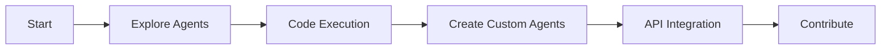

# 🚀 Agentic AI System - Flow Start Guide

<div align="center">


**🌟 Your Journey to AI Automation Excellence Starts Here 🌟**

**Created by Mulky Malikul Dhaher from Indonesia 🇮🇩**

</div>

---

## 🎯 Welcome to the Future of AI Automation

**Agentic AI System v2.0.0** is your gateway to revolutionary AI-powered automation. This Flow Start guide will take you from zero to AI automation hero in minutes, not hours.

### 🌟 **What You're About to Experience:**
- **14+ AI Agents** working in perfect harmony
- **Voice Control** in 10+ languages with offline support
- **Military-grade Security** with enterprise encryption
- **Multi-LLM Gateway** with free LLM7 priority
- **Progressive Web App** that works offline
- **One-click Deployment** to 7+ cloud platforms

---

## ⚡ Quick Start Flow (5 Minutes to AI Power)

### **Step 1: Clone & Install (2 minutes)**
```bash
# 🚀 Get the system
git clone https://github.com/tokenew6/Agentic-AI-Ecosystem.git
cd Agentic-AI-Ecosystem

# 📦 Install magic
pip install -r requirements.txt

# ⚙️ Quick setup
cp .env.example .env
```

### **Step 2: Launch System (1 minute)**
```bash
# 🔥 Start the AI revolution
python web_interface/app.py

# 🌐 Open your browser to: http://localhost:5000
```

### **Step 3: Voice Activation (30 seconds)**
```bash
# 🎤 Press Ctrl+Space anywhere and say:
"Hello, show me the agent network"
"Create a new data analysis agent"
"Execute Python code for me"
```

### **Step 4: Install as App (30 seconds)**
- Click **"Install App"** button in browser
- **Add to Home Screen** on mobile
- **Pin to Taskbar** on desktop

### **Step 5: Explore & Automate (Forever)**
- 🤖 **Agent Network**: `/agents` - See all 14+ AI agents
- 🔐 **Credentials**: `/credentials` - Secure platform access
- 🧠 **LLM Providers**: `/llm_providers` - Multi-AI management  
- 💻 **Code Execution**: `/code` - Multi-language playground

---

## 🎨 Flow Paths - Choose Your Adventure

### 🏢 **Enterprise Flow (Business Users)**


**Perfect for:** CEOs, CTOs, Business Managers
- **Time to Value:** 15 minutes
- **Key Benefits:** Instant productivity, cost savings, automation

### 👨‍💻 **Developer Flow (Technical Users)**


**Perfect for:** Developers, DevOps, Technical Leads
- **Time to Value:** 10 minutes
- **Key Benefits:** Code automation, AI-powered development, extensibility

### 🎓 **Learning Flow (Students & Enthusiasts)**


**Perfect for:** Students, Researchers, AI Enthusiasts
- **Time to Value:** 5 minutes
- **Key Benefits:** Learn AI, hands-on experience, community

---

## 🚀 Power User Flows

### **🎤 Voice-First Flow**
1. **Activate**: Press `Ctrl+Space`
2. **Command**: Say your intent in any language
3. **Execute**: Watch AI agents work
4. **Iterate**: Give feedback and refine

**Voice Commands to Try:**
```
"Create a web scraping agent"
"Analyze this CSV file for insights"
"Deploy my app to production"
"Optimize system performance"
"Login to all my platforms"
```

### **🔐 Security-First Flow**
1. **Encrypt**: Store all credentials securely
2. **Authenticate**: Auto-login to 10+ platforms
3. **Monitor**: Track all security activities
4. **Audit**: Review security logs

**Security Features:**
- 🔒 AES-256 encryption
- 🛡️ Military-grade security
- 📊 Comprehensive audit logs
- 🔄 Automatic session management

### **🧠 AI-First Flow**
1. **Connect**: Link multiple LLM providers
2. **Optimize**: Use free LLM7 as primary
3. **Scale**: Auto-failover when needed
4. **Analyze**: Track usage and costs

**LLM Providers:**
- 🆓 LLM7 (Free, Priority #1)
- 🔄 OpenRouter (Multi-model hub)
- 🧠 DeepSeek (Advanced reasoning)
- 🤖 OpenAI (GPT models)
- 👥 Anthropic (Claude models)

---

## 📱 Platform-Specific Flows

### **💻 Desktop Flow**
- **Install PWA**: Full offline capabilities
- **Voice Hotkeys**: Ctrl+Space activation
- **Multi-monitor**: Drag agents across screens
- **Keyboard Shortcuts**: Power user efficiency

### **📱 Mobile Flow**
- **Add to Home**: Native app experience
- **Touch Voice**: Tap to activate voice
- **Offline Sync**: Works without internet
- **Push Notifications**: Real-time updates

### **☁️ Cloud Flow**
- **One-click Deploy**: Railway, Vercel, Netlify
- **Auto-scale**: Handle any load
- **Global CDN**: Worldwide performance
- **Enterprise SSO**: Corporate integration

---

## 🔄 Integration Flows

### **🔗 GitHub Flow**
```bash
# Connect GitHub account
"Add GitHub credentials"

# Automate workflow
"Create a new repository for my AI project"
"Deploy latest changes to production"
"Generate documentation from code"
```

### **📊 Data Flow**
```python
# Upload data
"Analyze this sales data CSV"

# Get insights
"Show me trends and predictions"

# Create reports
"Generate executive summary"
```

### **🤖 Agent Flow**
```bash
# Create specialized agent
"Create an agent for social media management"

# Train and deploy
"Train this agent with my data"
"Deploy agent to handle customer support"
```

---

## 🛠️ Customization Flows

### **🎨 UI Customization**
```css
/* Custom themes */
:root {
    --primary-color: #your-brand-color;
    --secondary-color: #your-accent-color;
}
```

### **🔧 Agent Development**
```python
# Create custom agent
class MyBusinessAgent:
    def __init__(self):
        self.capabilities = ["custom_automation"]
    
    async def process_task(self, task):
        # Your business logic here
        return {"success": True}
```

### **🌐 Platform Integration**
```python
# Add new platform
PLATFORMS = {
    'my_platform': {
        'name': 'My Business Platform',
        'auth_methods': ['api_key', 'oauth'],
        'capabilities': ['automation', 'analytics']
    }
}
```

---

## 📈 Success Metrics & KPIs

### **📊 Track Your Progress**

| Metric | Beginner | Intermediate | Expert |
|--------|----------|--------------|--------|
| **Agents Created** | 1-3 | 4-10 | 10+ |
| **Platforms Connected** | 1-2 | 3-5 | 5+ |
| **Voice Commands/Day** | 5-10 | 10-50 | 50+ |
| **Automation Hours Saved** | 1-2h | 3-8h | 8h+ |
| **Cost Savings** | $10-50 | $50-200 | $200+ |

### **🎯 Achievement Unlocks**
- 🥉 **Bronze**: First agent created
- 🥈 **Silver**: 5 platforms connected
- 🥇 **Gold**: Custom agent deployed
- 💎 **Diamond**: Community contributor
- 🏆 **Legend**: Enterprise deployment

---

## 🌍 Community Flows

### **🤝 Contribution Flow**
1. **Fork**: Create your version
2. **Develop**: Add amazing features
3. **Test**: Ensure quality
4. **Submit**: Open pull request
5. **Celebrate**: Join the community

### **📚 Learning Flow**
1. **Documentation**: Read comprehensive guides
2. **Examples**: Try sample implementations
3. **Community**: Join Discord discussions
4. **Mentorship**: Help others learn
5. **Innovation**: Create something new

### **🌟 Recognition Flow**
1. **Contribute**: Make meaningful additions
2. **Document**: Share your knowledge  
3. **Teach**: Help community members
4. **Lead**: Drive innovation
5. **Recognition**: Hall of fame

---

## 🚀 Deployment Flows

### **🔥 Instant Deployment (2 minutes)**
```bash
# Railway (Recommended)
npm install -g @railway/cli
railway login && railway init && railway up

# Vercel (Serverless)  
npm install -g vercel && vercel

# Netlify (JAMstack)
npm install -g netlify-cli && netlify deploy --prod
```

### **🏢 Enterprise Deployment**
```bash
# Docker
docker build -t agentic-ai .
docker run -p 5000:5000 agentic-ai

# Kubernetes
kubectl apply -f k8s-deployment.yaml
kubectl scale deployment agentic-ai --replicas=10
```

### **🌐 Global Deployment**
- **Multi-region**: Deploy across continents
- **Load balancing**: Handle millions of users
- **Auto-scaling**: Scale based on demand
- **Monitoring**: 24/7 health checks

---

## 🎯 Next Steps & Advanced Flows

### **🚀 Immediate Actions (Next 15 minutes)**
1. ✅ **Complete Quick Start** (if not done)
2. ✅ **Create first agent** with voice command
3. ✅ **Add one credential** for automation
4. ✅ **Test code execution** in preferred language
5. ✅ **Install PWA** for native experience

### **📈 Short-term Goals (Next week)**
1. 🎯 **Connect 3+ platforms** for automation
2. 🎯 **Configure multiple LLM providers** for reliability
3. 🎯 **Create custom workflow** for your use case
4. 🎯 **Deploy to cloud** for global access
5. 🎯 **Join community** and share experience

### **🌟 Long-term Vision (Next month)**
1. 🚀 **Build custom agents** for your domain
2. 🚀 **Integrate with existing systems** 
3. 🚀 **Scale to enterprise level**
4. 🚀 **Contribute to open source**
5. 🚀 **Become AI automation expert**

---

## 💡 Pro Tips & Best Practices

### **⚡ Performance Optimization**
- Use **LLM7 free provider** for cost savings
- Enable **response caching** for faster responses
- Configure **auto-scaling** for high load
- Monitor **health metrics** continuously

### **🔒 Security Best Practices**
- Store all credentials in **encrypted vault**
- Enable **audit logging** for compliance
- Use **strong master passwords**
- Regular **security audits**

### **🎤 Voice Command Mastery**
- Speak **clearly and naturally**
- Use **specific commands** for better results
- Try **different languages** for fun
- Practice **complex workflows**

### **🤝 Community Engagement**
- **Share your use cases** for inspiration
- **Help newcomers** get started
- **Report bugs** constructively
- **Suggest features** thoughtfully

---

## 🆘 Troubleshooting & Support

### **🔧 Common Issues & Solutions**

| Issue | Solution |
|-------|----------|
| **Voice not working** | Check microphone permissions, try Ctrl+Space |
| **Agents not responding** | Restart system, check logs |
| **Credentials not saving** | Verify encryption setup, check permissions |
| **Slow performance** | Enable caching, check system resources |
| **Deployment fails** | Check environment variables, verify platform setup |

### **📞 Get Help**
- **🐛 Bug Reports**: [GitHub Issues](https://github.com/tokenew6/Agentic-AI-Ecosystem/issues)
- **💬 Community**: [Discord Server](https://discord.gg/agentic-ai)
- **📚 Documentation**: [Complete Wiki](https://github.com/tokenew6/Agentic-AI-Ecosystem/wiki)
- **📧 Direct Support**: support@agentic-ai.com

---

## 🎉 Welcome to the AI Revolution!

<div align="center">

**🎯 You're now ready to transform your productivity with AI automation!**

### **Choose Your Starting Point:**

[](#-quick-start-flow-5-minutes-to-ai-power)
[](#-enterprise-flow-business-users)
[](#-developer-flow-technical-users)
[](#-learning-flow-students--enthusiasts)

### **🌟 Remember: The future of AI automation is in your hands!**

**🇮🇩 Built with Indonesian innovation for global impact 🇮🇩**

*Mulky Malikul Dhaher - Pioneering AI automation from Indonesia to the world*

</div>

---

<div align="center">

**© 2025 Mulky Malikul Dhaher • Made with ❤️ in Indonesia 🇮🇩**

*Your journey to AI mastery starts now. Welcome to the future!*

</div>
