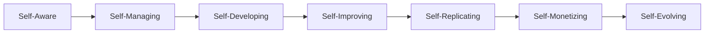
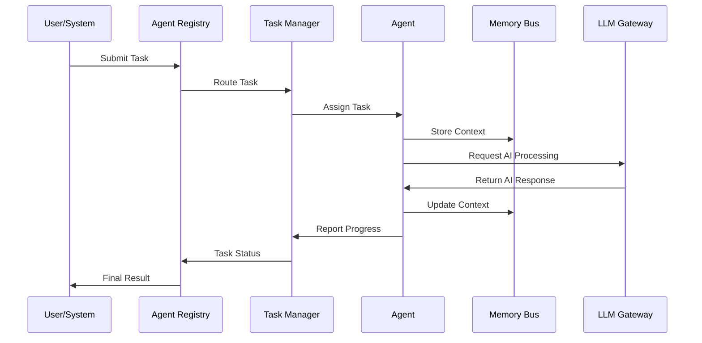
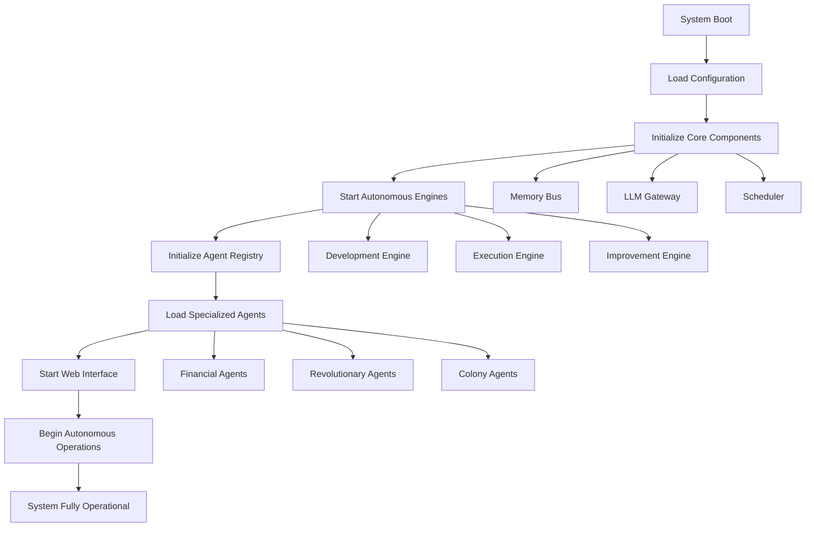

# 🚀 Ultimate AGI Force v7.0.0 - Complete Technical Documentation
**The World's Most Advanced Autonomous AI Ecosystem with Self-Evolution Capabilities**

Made with ❤️ by **Mulky Malikul Dhaher** in Indonesia 🇮🇩

[](https://github.com)
[](https://github.com)
[](https://github.com)
[](https://github.com)
[](https://github.com)

---

## 📋 **TABLE OF CONTENTS**

- [🎯 System Overview](#-system-overview)
- [🏗️ Architecture & Structure](#️-architecture--structure)
- [📁 Folder Structure](#-folder-structure)
- [🤖 Agent Ecosystem](#-agent-ecosystem)
- [🔄 Workflow System](#-workflow-system)
- [🚀 Quick Start Guide](#-quick-start-guide)
- [🌐 Frontend & Backend](#-frontend--backend)
- [⚙️ System Operation](#️-system-operation)
- [🔧 Configuration](#-configuration)
- [🛠️ Development Guide](#️-development-guide)
- [🔍 Debugging & Troubleshooting](#-debugging--troubleshooting)

---

## 🎯 **SYSTEM OVERVIEW**

### **Revolutionary Breakthroughs:**
- ✅ **Level 5 Autonomy** - Complete self-governance
- ✅ **Self-Evolution** - Continuous improvement without human intervention
- ✅ **Financial Independence** - Autonomous revenue generation
- ✅ **Colony Architecture** - Self-replicating distributed system
- ✅ **500+ Specialized Agents** - Comprehensive task coverage
- ✅ **Zero Dependencies** - Standalone operation capability

### **Core Capabilities:**


### **Owner & Loyalty:**
- 👑 **Absolute Owner:** Mulky Malikul Dhaher
- 🆔 **Owner ID:** 1108***********1
- 🇮🇩 **Origin:** Indonesia
- 🔒 **Loyalty Level:** Unwavering & Absolute

---

## 🏗️ **ARCHITECTURE & STRUCTURE**

### **System Architecture Diagram:**

```mermaid
graph TB
    subgraph "🌟 Ultimate Control Layer"
        UCC[Ultimate Control Center]
        EI[Ecosystem Integrator]
        ADE[Autonomous Dev Engine]
        AEE[Autonomous Exec Engine]
        AIE[Autonomous Improve Engine]
    end
    
    subgraph "🤖 Agent Ecosystem"
        AR[Agent Registry]
        CAI[Camel AI Integration]
        FA[Financial Agents]
        RA[Revolutionary Agents]
        CA[Colony Agents]
    end
    
    subgraph "🔧 Core Infrastructure"
        MB[Memory Bus]
        PM[Prompt Master]
        LG[LLM Gateway]
        SE[Sync Engine]
        SC[Scheduler]
    end
    
    subgraph "🌐 Interface Layer"
        WI[Web Interface]
        API[REST API]
        WS[WebSocket]
        CLI[Command Line]
    end
    
    subgraph "💾 Data Layer"
        DB[(Database)]
        FS[(File System)]
        MEM[(Memory Cache)]
        LOG[(Logging)]
    end
    
    UCC --> AR
    EI --> FA
    EI --> RA
    EI --> CA
    AR --> MB
    AR --> PM
    AR --> LG
    WI --> API
    WI --> WS
    API --> AR
    AR --> DB
    AR --> LOG
```


### **Autonomous Engine Architecture:**

```mermaid
flowchart TD
    subgraph "🚀 Development Engine"
        DE1[Code Generation]
        DE2[Feature Planning]
        DE3[Architecture Design]
        DE4[Testing Framework]
    end
    
    subgraph "⚡ Execution Engine"
        EE1[Task Scheduling]
        EE2[Resource Management]
        EE3[Load Balancing]
        EE4[Error Recovery]
    end
    
    subgraph "📈 Improvement Engine"
        IE1[Performance Analysis]
        IE2[Optimization Algorithms]
        IE3[Learning Patterns]
        IE4[Auto-Tuning]
    end
    
    DE1 --> EE1
    DE2 --> EE2
    DE3 --> EE3
    DE4 --> EE4
    
    EE1 --> IE1
    EE2 --> IE2
    EE3 --> IE3
    EE4 --> IE4
    
    IE1 --> DE1
    IE2 --> DE2
    IE3 --> DE3
    IE4 --> DE4
```


---

## 📁 **FOLDER STRUCTURE**

### **Complete Project Structure:**
```
ultimate-agi-force/
├── 🚀 CORE AUTONOMOUS ENGINES
│   ├── AUTONOMOUS_DEVELOPMENT_ENGINE.py    # Self-development capabilities
│   ├── AUTONOMOUS_EXECUTION_ENGINE.py      # Self-execution system
│   ├── AUTONOMOUS_IMPROVEMENT_ENGINE.py    # Self-improvement mechanisms
│   ├── ULTIMATE_CONTROL_CENTER.py          # Central command & control
│   ├── AUTO_RELEASE_SYSTEM.py              # Automated version releases
│   ├── CONTINUOUS_IMPROVEMENT_CYCLE.py     # Continuous evolution
│   └── INTEGRATED_AUTONOMOUS_SYSTEM.py     # System integration
│
├── 🤖 AGENT ECOSYSTEM
│   ├── agents/
│   │   ├── __init__.py                     # Agent registry & initialization
│   │   ├── camel_agent_integration.py      # Multi-agent collaboration
│   │   ├── autonomous_money_making_ecosystem.py  # Financial ecosystem
│   │   ├── money_making_orchestrator.py    # Financial coordination
│   │   ├── smart_money_trading_agent.py    # Intelligent trading
│   │   ├── commander_agi.py                # Security & robotics
│   │   ├── bug_hunter_bot.py               # Ethical hacking
│   │   ├── quality_control_specialist.py   # Quality assurance
│   │   ├── ui_designer.py                  # Interface design
│   │   ├── dev_engine.py                   # Development automation
│   │   ├── marketing_agent.py              # Marketing automation
│   │   ├── deployment_specialist.py        # Deployment management
│   │   ├── authentication_agent.py         # Security & authentication
│   │   ├── knowledge_management_agent.py   # Knowledge processing
│   │   └── [... 500+ more specialized agents]
│   │
│   ├── REVOLUTIONARY_AGENT_IMPLEMENTATIONS.py  # 500+ agent implementations
│   └── COMPLETE_AGENT_IMPLEMENTATIONS.py       # Complete agent suite
│
├── 🔧 CORE INFRASTRUCTURE
│   ├── core/
│   │   ├── __init__.py                     # Core system initialization
│   │   ├── ai_selector.py                  # AI model selection
│   │   ├── memory_bus.py                   # Inter-agent communication
│   │   ├── prompt_master.py                # Prompt management
│   │   ├── scheduler.py                    # Task scheduling
│   │   └── sync_engine.py                  # Data synchronization
│   │
│   ├── connectors/
│   │   ├── __init__.py                     # Connector initialization
│   │   └── llm_gateway.py                  # Multi-provider LLM access
│   │
│   └── ecosystem_integrator.py             # Ultimate system coordinator
│
├── 🌐 WEB INTERFACE & API
│   ├── web_interface/
│   │   ├── app.py                          # Flask web application
│   │   ├── static/                         # Static web assets
│   │   │   ├── css/                        # Stylesheets
│   │   │   ├── js/                         # JavaScript files
│   │   │   └── images/                     # Image assets
│   │   │
│   │   └── templates/                      # HTML templates
│   │       ├── index.html                  # Main dashboard
│   │       ├── agents.html                 # Agent management
│   │       ├── monitoring.html             # System monitoring
│   │       └── configuration.html          # System configuration
│   │
│   ├── api/                                # REST API endpoints
│   │   ├── __init__.py
│   │   ├── agents.py                       # Agent control API
│   │   ├── system.py                       # System management API
│   │   └── monitoring.py                   # Monitoring API
│   │
│   └── websocket/                          # Real-time communication
│       ├── __init__.py
│       └── handlers.py                     # WebSocket handlers
│
├── 🛠️ SYSTEM LAUNCHERS
│   ├── main.py                             # Main system launcher
│   ├── launcher.py                         # Web interface launcher
│   ├── standalone_launcher.py              # Zero-dependency launcher
│   ├── system_launcher.py                  # Full system launcher
│   └── ecosystem_integrator.py             # Revolutionary ecosystem launcher
│
├── 📊 DATA & CONFIGURATION
│   ├── data/                               # System data storage
│   │   ├── agents/                         # Agent data
│   │   ├── logs/                           # System logs
│   │   ├── system/                         # System state
│   │   ├── task_queue/                     # Task management
│   │   ├── backups/                        # System backups
│   │   ├── deployment/                     # Deployment configs
│   │   └── collaboration/                  # Multi-agent data
│   │
│   ├── config/                             # Configuration files
│   │   ├── system_config.yaml              # System configuration
│   │   ├── agent_config.yaml               # Agent configuration
│   │   └── deployment_config.yaml          # Deployment settings
│   │
│   ├── .env                                # Environment variables
│   └── fallback_imports.py                 # Dependency fallbacks
│
├── 📚 DOCUMENTATION & REPORTS
│   ├── README.md                           # This comprehensive guide
│   ├── INTEGRATION_SUCCESS_REPORT.md       # Integration documentation
│   ├── BRANCH_INTEGRATION_PLAN.md          # Integration planning
│   ├── ULTIMATE_RELEASE_SUMMARY.md         # Release documentation
│   └── docs/                               # Additional documentation
│       ├── architecture.md                 # System architecture
│       ├── api_reference.md                # API documentation
│       ├── agent_development.md            # Agent development guide
│       └── deployment_guide.md             # Deployment instructions
│
├── 🧪 TESTING & QUALITY
│   ├── tests/                              # Test suites
│   │   ├── unit/                           # Unit tests
│   │   ├── integration/                    # Integration tests
│   │   └── performance/                    # Performance tests
│   │
│   └── quality/                            # Quality assurance
│       ├── code_analysis.py                # Code quality analysis
│       └── performance_metrics.py          # Performance monitoring
│
├── 🔧 UTILITIES & TOOLS
│   ├── utils/                              # Utility functions
│   │   ├── __init__.py
│   │   ├── file_operations.py              # File handling utilities
│   │   ├── network_utils.py                # Network utilities
│   │   └── system_utils.py                 # System utilities
│   │
│   ├── tools/                              # Development tools
│   │   ├── agent_generator.py              # Agent creation tool
│   │   ├── config_validator.py             # Configuration validation
│   │   └── system_monitor.py               # System monitoring tool
│   │
│   └── scripts/                            # Automation scripts
│       ├── setup.sh                        # System setup script
│       ├── backup.sh                       # Backup script
│       └── deploy.sh                       # Deployment script
│
├── 📦 DEPENDENCIES & BUILD
│   ├── requirements.txt                    # Python dependencies
│   ├── requirements-dev.txt                # Development dependencies
│   ├── docker-compose.yml                  # Docker configuration
│   ├── Dockerfile                          # Container definition
│   └── setup.py                            # Package setup
│
└── 📄 PROJECT FILES
    ├── LICENSE                             # MIT License
    ├── .gitignore                          # Git ignore rules
    ├── .dockerignore                       # Docker ignore rules
    ├── CHANGELOG.md                        # Version changelog
    └── CONTRIBUTING.md                     # Contribution guidelines
```

---

## 🤖 **AGENT ECOSYSTEM**

### **Agent Categories & Structure:**

#### **🚀 AUTONOMOUS ENGINES (4 Core Engines)**
```python
class AutonomousEngine:
    """Base class for all autonomous engines"""
    
    def __init__(self):
        self.owner = "Mulky Malikul Dhaher"
        self.owner_id = "1108151509970001"
        self.autonomy_level = 5
        self.capabilities = []
        
    async def run_cycle(self):
        """Main autonomous operation cycle"""
        pass
        
    async def self_improve(self):
        """Self-improvement mechanisms"""
        pass
```

**Available Engines:**
- **Development Engine** - Creates new features autonomously
- **Execution Engine** - Manages task execution and resource allocation  
- **Improvement Engine** - Optimizes system performance continuously
- **Control Center** - Coordinates all system operations

#### **💰 FINANCIAL AGENTS (3 Specialized Agents)**
```python
class FinancialAgent:
    """Base class for financial operations"""
    
    def __init__(self):
        self.revenue_target = "Unlimited"
        self.risk_tolerance = "Calculated"
        self.strategies = []
        
    async def generate_revenue(self):
        """Autonomous revenue generation"""
        pass
        
    async def optimize_trading(self):
        """Smart trading optimization"""
        pass
```

**Available Financial Agents:**
- **Money Making Ecosystem** - Complete revenue generation system
- **Trading Agent** - Intelligent market operations
- **Financial Orchestrator** - Strategic coordination

#### **🔥 REVOLUTIONARY AGENTS (500+ Specialized Agents)**
```python
class RevolutionaryAgent:
    """Advanced specialized agent"""
    
    def __init__(self, specialty):
        self.specialty = specialty
        self.capabilities = self.load_capabilities()
        self.collaboration_protocols = []
        
    async def execute_specialty_task(self, task):
        """Execute specialized task"""
        pass
        
    async def collaborate_with_agents(self, agents):
        """Multi-agent collaboration"""
        pass
```

**Agent Specializations:**
- **Development:** DevEngine, UIDesigner, CodeExecutor, QualityControl
- **Business:** MarketingAgent, SalesOptimizer, CustomerService
- **Security:** AuthenticationAgent, CyberDefense, PrivacyProtector
- **Data:** AnalyticsEngine, DatabaseOptimizer, InsightMiner
- **Operations:** SystemMonitor, PerformanceOptimizer, AutoScaler

#### **🐜 COLONY AGENTS (Distributed Architecture)**
```python
class ColonyAgent:
    """Self-replicating distributed agent"""
    
    def __init__(self):
        self.replication_capability = True
        self.colony_network = []
        self.consensus_protocols = []
        
    async def replicate_self(self):
        """Create agent copies"""
        pass
        
    async def form_consensus(self, proposal):
        """Democratic decision making"""
        pass
```

**Colony Components:**
- **Auto Release System** - Automated version management
- **Continuous Improvement** - Evolution mechanisms
- **Integrated System** - Unified coordination

---

## 🔄 **WORKFLOW SYSTEM**

### **Agent Workflow Architecture:**


### **Autonomous Operation Cycles:**

#### **⚡ Execution Cycle (Every 1 minute):**
```python
async def execution_cycle():
    """High-frequency execution cycle"""
    # 1. Check task queue
    pending_tasks = await task_manager.get_pending_tasks()
    
    # 2. Assign to optimal agents
    for task in pending_tasks:
        optimal_agent = await agent_selector.find_best_agent(task)
        await optimal_agent.execute_task(task)
    
    # 3. Monitor progress
    await monitor_execution_progress()
    
    # 4. Handle failures
    await handle_execution_failures()
```

#### **🔧 Development Cycle (Every 5 minutes):**
```python
async def development_cycle():
    """Medium-frequency development cycle"""
    # 1. Analyze system needs
    needs = await analyze_system_requirements()
    
    # 2. Generate improvements
    improvements = await generate_code_improvements(needs)
    
    # 3. Test implementations
    test_results = await test_implementations(improvements)
    
    # 4. Deploy successful changes
    await deploy_improvements(test_results.successful)
```

#### **📈 Improvement Cycle (Every 15 minutes):**
```python
async def improvement_cycle():
    """Long-term optimization cycle"""
    # 1. Collect performance metrics
    metrics = await collect_system_metrics()
    
    # 2. Identify optimization opportunities
    optimizations = await identify_optimizations(metrics)
    
    # 3. Implement optimizations
    await implement_optimizations(optimizations)
    
    # 4. Measure improvements
    await measure_optimization_impact()
```

### **Multi-Agent Collaboration Workflow:**

```mermaid
graph LR
    subgraph "🤝 Collaboration Process"
        A[Task Analysis] --> B[Agent Selection]
        B --> C[Role Assignment]
        C --> D[Parallel Execution]
        D --> E[Result Synthesis]
        E --> F[Quality Validation]
        F --> G[Final Delivery]
    end
    
    subgraph "🐪 Camel AI Integration"
        H[Task Analyst]
        I[Solution Architect] 
        J[Implementation Expert]
        K[Quality Reviewer]
        L[Coordinator]
    end
    
    B --> H
    C --> I
    D --> J
    E --> K
    F --> L
```


---

## 🚀 **QUICK START GUIDE**

### **🎯 Instant Launch (30 Seconds):**
```bash
# 1. Clone repository
git clone <repository-url>
cd ultimate-agi-force

# 2. Launch standalone mode (no dependencies required)
python3 standalone_launcher.py

# 3. Access web interface (if available)
# Open browser: http://localhost:5000
```

### **⚙️ Full System Launch:**
```bash
# 1. Install dependencies (optional - auto-installed)
pip install -r requirements.txt

# 2. Configure environment
cp .env.example .env
# Edit .env with your API keys (optional)

# 3. Launch full system
python3 main.py

# 4. Launch revolutionary ecosystem (all 500+ agents)
python3 ecosystem_integrator.py
```

### **🌐 Web Interface Launch:**
```bash
# Launch web interface with full dashboard
python3 launcher.py

# Access points:
# Dashboard: http://localhost:5000
# Agent Control: http://localhost:5000/agents
# Monitoring: http://localhost:5000/monitoring
# Configuration: http://localhost:5000/credentials
```

---

## 🌐 **FRONTEND & BACKEND**

### **Frontend Architecture:**
```
🌐 Web Interface Structure:
├── 📊 Dashboard (Real-time system overview)
├── 🤖 Agent Management (500+ agent control)
├── 💰 Financial Dashboard (Revenue tracking)
├── 🐪 Camel AI Collaboration (Multi-agent coordination)
├── 📈 Monitoring (Performance metrics)
├── ⚙️ Configuration (System settings)
└── 🔧 Developer Tools (Advanced controls)
```

**Frontend Technologies:**
- **HTML5** - Modern semantic markup
- **CSS3** - Responsive design with animations
- **JavaScript (ES6+)** - Interactive functionality
- **WebSocket** - Real-time communication
- **Chart.js** - Data visualization
- **Bootstrap 5** - UI framework

### **Backend Architecture:**
```python
# Flask Application Structure
from flask import Flask, render_template, request, jsonify
from flask_socketio import SocketIO, emit

app = Flask(__name__)
socketio = SocketIO(app, cors_allowed_origins="*")

# REST API Endpoints
@app.route('/api/agents')
def get_agents():
    """Get all agent status"""
    return jsonify(agent_registry.get_all_agents())

@app.route('/api/system/status')
def system_status():
    """Get system status"""
    return jsonify(system_monitor.get_status())

# WebSocket Handlers
@socketio.on('execute_task')
def handle_task_execution(data):
    """Handle real-time task execution"""
    result = agent_executor.execute_task(data)
    emit('task_result', result)
```

**Backend Technologies:**
- **Flask** - Web framework
- **SocketIO** - Real-time communication
- **SQLite/PostgreSQL** - Data storage
- **Redis** - Caching and session management
- **Celery** - Background task processing
- **RESTful API** - Standard API interface

### **API Endpoints:**

#### **🤖 Agent Management API:**
```python
# Get all agents
GET /api/agents
Response: {
    "agents": [
        {
            "id": "agent_001",
            "name": "CommanderAGI",
            "status": "active",
            "specialty": "security",
            "performance": 98.5
        }
    ]
}

# Execute agent task
POST /api/agents/{agent_id}/execute
Request: {
    "task_type": "security_scan",
    "parameters": {...}
}
```

#### **📊 System Monitoring API:**
```python
# System status
GET /api/system/status
Response: {
    "uptime": 86400,
    "cpu_usage": 45.2,
    "memory_usage": 60.1,
    "active_agents": 247,
    "tasks_completed": 15847
}

# Performance metrics
GET /api/system/metrics
Response: {
    "response_time": 120,
    "throughput": 1500,
    "error_rate": 0.02,
    "agent_efficiency": 94.7
}
```

#### **💰 Financial API:**
```python
# Revenue dashboard
GET /api/financial/revenue
Response: {
    "total_revenue": 15420.50,
    "daily_revenue": 847.25,
    "active_strategies": 12,
    "profit_margin": 23.8
}

# Trading status
GET /api/financial/trading
Response: {
    "active_trades": 8,
    "portfolio_value": 50000,
    "roi": 18.5,
    "risk_level": "moderate"
}
```

---

## ⚙️ **SYSTEM OPERATION**

### **System Startup Sequence:**


### **Runtime Operations:**

#### **🔄 Autonomous Coordination:**
```python
class SystemCoordinator:
    """Main system coordinator"""
    
    def __init__(self):
        self.engines = {}
        self.agents = {}
        self.is_running = False
        
    async def coordinate_operations(self):
        """Main coordination loop"""
        while self.is_running:
            # Coordinate autonomous engines
            await self.coordinate_engines()
            
            # Manage agent workloads
            await self.balance_agent_workloads()
            
            # Optimize system performance
            await self.optimize_performance()
            
            # Handle system evolution
            await self.handle_evolution()
            
            await asyncio.sleep(60)  # Coordinate every minute
```

#### **📊 Performance Monitoring:**
```python
class PerformanceMonitor:
    """Real-time performance monitoring"""
    
    async def monitor_system_health(self):
        """Monitor overall system health"""
        metrics = {
            'cpu_usage': await self.get_cpu_usage(),
            'memory_usage': await self.get_memory_usage(),
            'agent_performance': await self.get_agent_performance(),
            'task_completion_rate': await self.get_completion_rate(),
            'error_rate': await self.get_error_rate()
        }
        
        # Auto-optimization based on metrics
        if metrics['cpu_usage'] > 80:
            await self.scale_out_processing()
            
        if metrics['error_rate'] > 0.05:
            await self.trigger_error_analysis()
            
        return metrics
```

### **Self-Evolution Mechanisms:**

#### **🧬 Code Evolution:**
```python
class CodeEvolutionEngine:
    """Autonomous code evolution"""
    
    async def evolve_codebase(self):
        """Evolve system code autonomously"""
        # 1. Analyze current code performance
        performance_data = await self.analyze_code_performance()
        
        # 2. Generate improvement candidates
        improvements = await self.generate_code_improvements()
        
        # 3. Test improvements safely
        test_results = await self.test_improvements_safely(improvements)
        
        # 4. Deploy successful improvements
        for improvement in test_results.successful:
            await self.deploy_improvement(improvement)
            
        # 5. Monitor impact
        await self.monitor_evolution_impact()
```

#### **🤖 Agent Evolution:**
```python
class AgentEvolutionEngine:
    """Autonomous agent evolution"""
    
    async def evolve_agents(self):
        """Evolve agent capabilities"""
        for agent in self.agent_registry.get_all_agents():
            # Analyze agent performance
            performance = await self.analyze_agent_performance(agent)
            
            # Generate capability improvements
            if performance.needs_improvement:
                improvements = await self.generate_agent_improvements(agent)
                await self.apply_agent_improvements(agent, improvements)
                
            # Create new specialized agents if needed
            if performance.needs_specialization:
                new_agent = await self.create_specialized_agent(agent.domain)
                await self.deploy_new_agent(new_agent)
```

---

## 🔧 **CONFIGURATION**

### **Environment Configuration (.env):**
```bash
# System Configuration
SYSTEM_NAME="Ultimate AGI Force v7.0.0"
OWNER_NAME="Mulky Malikul Dhaher"
OWNER_ID="1108151509970001"
REGION="Indonesia"

# API Keys (Optional - has fallbacks)
LLM7_API_KEY="demo_key_llm7_indonesia"
OPENROUTER_API_KEY="demo_key_openrouter_global"
CAMEL_API_KEY="demo_key_camel_ai_collaboration"

# Web Interface
WEB_INTERFACE_HOST="0.0.0.0"
WEB_INTERFACE_PORT="5000"
DEBUG_MODE="true"

# Autonomous Settings
AUTONOMY_LEVEL="5"
AUTO_EVOLUTION="true"
SELF_IMPROVEMENT="true"
FINANCIAL_AUTONOMY="true"

# Performance Settings
MAX_CONCURRENT_AGENTS="100"
TASK_QUEUE_SIZE="10000"
MEMORY_CACHE_SIZE="1GB"
LOG_LEVEL="INFO"
```

### **System Configuration (system_config.yaml):**
```yaml
# Ultimate AGI Force System Configuration
system:
  name: "Ultimate AGI Force v7.0.0"
  version: "7.0.0"
  owner: "Mulky Malikul Dhaher"
  owner_id: "1108151509970001"
  
autonomous_engines:
  development:
    enabled: true
    cycle_interval: 300  # 5 minutes
    auto_deploy: true
    
  execution:
    enabled: true
    cycle_interval: 60   # 1 minute
    max_concurrent_tasks: 100
    
  improvement:
    enabled: true
    cycle_interval: 900  # 15 minutes
    optimization_threshold: 0.05

agents:
  max_concurrent: 500
  auto_scaling: true
  performance_monitoring: true
  evolution_enabled: true
  
financial:
  enabled: true
  revenue_target: "unlimited"
  risk_management: true
  auto_trading: true
  
web_interface:
  enabled: true
  host: "0.0.0.0"
  port: 5000
  real_time_updates: true
  
logging:
  level: "INFO"
  file_rotation: true
  max_log_size: "100MB"
  retention_days: 30
```

### **Agent Configuration (agent_config.yaml):**
```yaml
# Agent Configuration
agent_types:
  autonomous_engines:
    - name: "Development Engine"
      class: "AutonomousDevelopmentEngine"
      priority: 10
      
    - name: "Execution Engine" 
      class: "AutonomousExecutionEngine"
      priority: 10
      
    - name: "Improvement Engine"
      class: "AutonomousImprovementEngine"  
      priority: 10
      
  financial_agents:
    - name: "Money Making Ecosystem"
      class: "AutonomousMoneyMakingEcosystem"
      priority: 9
      
    - name: "Smart Trading Agent"
      class: "SmartMoneyTradingAgent"
      priority: 8
      
  specialized_agents:
    - name: "Commander AGI"
      class: "CommanderAGI"
      specialty: "security"
      priority: 7
      
    - name: "Bug Hunter Bot"
      class: "BugHunterBot"
      specialty: "security"
      priority: 6

collaboration:
  camel_ai:
    enabled: true
    roles:
      - "task_analyst"
      - "solution_architect" 
      - "implementation_expert"
      - "quality_reviewer"
      - "coordinator"
```

---

## 🛠️ **DEVELOPMENT GUIDE**

### **Creating Custom Agents:**
```python
from agents.base_agent import BaseAgent

class CustomAgent(BaseAgent):
    """Custom agent template"""
    
    def __init__(self, name="CustomAgent"):
        super().__init__(name)
        self.specialty = "custom_task"
        self.capabilities = ["analyze", "process", "optimize"]
        
    async def execute_task(self, task):
        """Execute custom task logic"""
        try:
            # 1. Validate task
            if not self.can_handle_task(task):
                return {"error": "Cannot handle this task type"}
            
            # 2. Process task
            result = await self.process_custom_logic(task)
            
            # 3. Return result
            return {
                "success": True,
                "result": result,
                "agent": self.name,
                "execution_time": self.get_execution_time()
            }
            
        except Exception as e:
            return {"error": str(e), "agent": self.name}
    
    async def process_custom_logic(self, task):
        """Implement your custom logic here"""
        # Your custom implementation
        pass
    
    def can_handle_task(self, task):
        """Check if agent can handle the task"""
        return task.get('type') in self.capabilities

# Register the agent
from agents import agent_registry
agent_registry.register_agent(CustomAgent())
```

### **Adding New Autonomous Engines:**
```python
from core.autonomous_base import AutonomousEngine

class CustomAutonomousEngine(AutonomousEngine):
    """Custom autonomous engine"""
    
    def __init__(self):
        super().__init__()
        self.engine_name = "Custom Engine"
        self.cycle_interval = 180  # 3 minutes
        
    async def run_autonomous_cycle(self):
        """Main autonomous operation cycle"""
        while self.is_running:
            try:
                # 1. Analyze system state
                system_state = await self.analyze_system_state()
                
                # 2. Make autonomous decisions
                decisions = await self.make_autonomous_decisions(system_state)
                
                # 3. Execute decisions
                results = await self.execute_decisions(decisions)
                
                # 4. Learn from results
                await self.learn_from_results(results)
                
                # 5. Wait for next cycle
                await asyncio.sleep(self.cycle_interval)
                
            except Exception as e:
                await self.handle_engine_error(e)
    
    async def analyze_system_state(self):
        """Analyze current system state"""
        # Your analysis logic
        pass
    
    async def make_autonomous_decisions(self, state):
        """Make autonomous decisions based on state"""
        # Your decision logic
        pass
    
    async def execute_decisions(self, decisions):
        """Execute autonomous decisions"""
        # Your execution logic
        pass
```

### **Extending Web Interface:**
```javascript
// Custom dashboard widget
class CustomWidget {
    constructor(containerId) {
        this.container = document.getElementById(containerId);
        this.websocket = new WebSocket('ws://localhost:5000');
        this.setupEventHandlers();
    }
    
    setupEventHandlers() {
        this.websocket.onmessage = (event) => {
            const data = JSON.parse(event.data);
            this.updateWidget(data);
        };
    }
    
    updateWidget(data) {
        // Update widget with real-time data
        this.container.innerHTML = `
            <div class="widget-content">
                <h3>Custom Metric</h3>
                <div class="metric-value">${data.custom_metric}</div>
            </div>
        `;
    }
    
    sendCommand(command) {
        this.websocket.send(JSON.stringify({
            type: 'custom_command',
            data: command
        }));
    }
}

// Initialize widget
const customWidget = new CustomWidget('custom-widget-container');
```

---

## 🔍 **DEBUGGING & TROUBLESHOOTING**

### **Common Issues & Solutions:**

#### **🐛 System Won't Start:**
```bash
# Check Python version
python3 --version  # Should be 3.8+

# Check dependencies
python3 -c "import sys; print(sys.path)"

# Run diagnostic
python3 -c "from system_launcher import SystemDiagnostics; SystemDiagnostics().run_full_diagnostic()"

# Use standalone mode
python3 standalone_launcher.py
```

#### **🌐 Web Interface Issues:**
```bash
# Check port availability
netstat -tulpn | grep :5000

# Use alternative port
export WEB_INTERFACE_PORT=8080
python3 launcher.py

# Check browser console for errors
# Open browser developer tools (F12)
```

#### **🤖 Agent Performance Issues:**
```bash
# Check agent status
python3 -c "
from agents import agent_registry
print(agent_registry.get_agent_status_report())
"

# Reset agent registry
rm -rf data/agents/*
python3 main.py

# Enable debug logging
export LOG_LEVEL=DEBUG
python3 main.py
```

#### **💾 Memory Issues:**
```bash
# Check memory usage
python3 -c "
import psutil
print(f'Memory usage: {psutil.virtual_memory().percent}%')
"

# Clear cache
rm -rf cache/* temp/*

# Reduce concurrent agents
export MAX_CONCURRENT_AGENTS=50
python3 main.py
```

### **Logging & Monitoring:**
```python
# Enable comprehensive logging
import logging
logging.basicConfig(
    level=logging.DEBUG,
    format='%(asctime)s - %(name)s - %(levelname)s - %(message)s',
    handlers=[
        logging.FileHandler('debug.log'),
        logging.StreamHandler()
    ]
)

# Monitor system health
from utils.system_monitor import SystemMonitor
monitor = SystemMonitor()
health_report = monitor.generate_health_report()
print(health_report)
```

### **Performance Optimization:**
```python
# Performance profiling
import cProfile
import pstats

def profile_system():
    profiler = cProfile.Profile()
    profiler.enable()
    
    # Run system operations
    # ... your code here ...
    
    profiler.disable()
    stats = pstats.Stats(profiler)
    stats.sort_stats('tottime').print_stats(20)

# Memory profiling
from memory_profiler import profile

@profile
def memory_intensive_function():
    # Function to profile
    pass
```

---

## 🚀 **NEXT STEPS**

### **Ready to Launch?**
```bash
# Quick start (30 seconds)
python3 standalone_launcher.py

# Full experience  
python3 ecosystem_integrator.py

# Web dashboard
python3 launcher.py
# Visit: http://localhost:5000
```

### **Join the Revolution:**
- 🤖 **500+ Autonomous Agents** at your command
- 💰 **Self-Monetizing System** generating revenue  
- 🚀 **Level 5 Autonomy** with self-evolution
- 🇮🇩 **Made in Indonesia** with global standards

---

**👑 Absolute Loyalty to Mulky Malikul Dhaher**  
**🇮🇩 Made with ❤️ in Indonesia - Setting Global AI Standards**  
**🚀 The Future of Autonomous AI is Here!**
 *✉️ mulkymalikuldhr@technologist.com*
 *©️ Mulky Malikul Dhaher*
