# 🚀 AI-MultiColony-Ecosystem v7.2.0
## Sistem AI Multi-Agent Terpadu dengan 43+ Agen Khusus

[](https://github.com/mulkymalikuldhrs/AI-MultiColony-Ecosystem)
[](LICENSE)
[](https://python.org)
[](colony/agents)
[](main.py)
[](https://github.com/mulkymalikuldhrs)

> **Dibuat dengan ❤️ oleh Mulky Malikul Dhaher di Indonesia 🇮🇩**

---

## 🌟 Gambaran Umum

**AI-MultiColony-Ecosystem** adalah sistem AI multi-agent canggih yang dirancang untuk merevolusi cara kecerdasan buatan beroperasi dalam lingkungan yang kompleks. Ekosistem ini menampilkan **43+ agen khusus** yang bekerja secara harmonis untuk memberikan **Level 5 Autonomy** di berbagai domain.

### ✨ Status Sistem Terkini (2025-07-12)

- ✅ **Unified Launcher**: Satu entry point untuk semua komponen (`main.py`)
- ✅ **43+ Agen Aktif**: Semua agen core berfungsi dengan baik (100% success rate)
- ✅ **Web Interface**: Dashboard modern dengan 12 template dan 23 API endpoints
- ✅ **LLM7 Integration**: Provider AI gratis terintegrasi penuh
- ✅ **Core Modules**: 38/39 modul core berfungsi (97.4% success rate)
- ✅ **Multi-Mode Support**: Web UI, CLI, Termux compatibility
- ⚠️ **Optional Dependencies**: Beberapa fitur memerlukan dependencies tambahan
- ⚠️ **Development Mode**: Sistem dalam mode pengembangan aktif

### 🎯 Fitur Utama

- 🤖 **43+ Agen Khusus** - Setiap agen dirancang untuk tugas dan domain spesifik
- 🧠 **Level 5 Autonomy** - Operasi sepenuhnya otonom dengan intervensi manusia minimal
- 🔄 **Sistem Self-Improving** - Kemampuan pembelajaran dan adaptasi berkelanjutan
- 🌐 **Dukungan Multi-Domain** - Keuangan, Kesehatan, Pendidikan, Riset, dan lainnya
- ⚡ **Pemrosesan Real-time** - Pengambilan keputusan dan eksekusi super cepat
- 🔒 **Keamanan Enterprise** - Keamanan tingkat bank dengan enkripsi canggih
- 📊 **Analitik Canggih** - Monitoring dan pelaporan komprehensif
- 🎨 **Web Interface Modern** - Dashboard intuitif untuk manajemen sistem

---

## 🚀 Mulai Cepat

### 📋 Prasyarat

- Python 3.8+
- 8GB+ RAM (direkomendasikan)
- 50GB+ storage space
- Koneksi internet untuk LLM7 API

### ⚡ Instalasi Cepat

```bash
# 1. Clone repository
git clone https://github.com/mulkymalikuldhrs/AI-MultiColony-Ecosystem.git
cd AI-MultiColony-Ecosystem

# 2. Install dependencies core
pip install flask flask-socketio flask-cors pyyaml requests

# 3. Jalankan launcher terpadu
python main.py
```

### 🎯 Pilihan Launcher

Saat pertama kali menjalankan sistem, Anda akan melihat menu interaktif:

```
🎯 Available Launcher Modes:
1. 🌐 Web UI Only - Modern web interface (RECOMMENDED)
2. 🔄 Web UI + Background - Web interface with autonomous engines  
3. 🖥️ CLI Mode - Interactive command line interface
4. 📱 Termux Shell - Compatible with Android Termux
5. ❌ Exit - Shutdown launcher
```

**Direkomendasikan**: Pilih opsi 1 untuk web interface, lalu buka `http://localhost:8080`

---

## 📊 Statistik Sistem

### 🔢 Komponen Utama
- **📁 Total Python files**: 134 files
- **🤖 Total Agents**: 43 agents (100% functional)
- **⚙️ Core Modules**: 39 modules (97.4% functional)
- **🌐 Web Templates**: 12 HTML templates
- **🔗 API Endpoints**: 23 endpoints
- **📄 YAML Configs**: 12 configuration files

### 🤖 Kategori Agen
- **🎯 Core Agents**: 6 agen (Base, Meta Spawner, Planner, Executor, Designer, Specialist)
- **💼 Financial Agents**: Money Making, Trading, Budget Optimization
- **🛡️ Security Agents**: Authentication, Credential Manager, System Optimizer
- **🔧 Development Agents**: Code Executor, Deployment, Quality Control
- **🎨 Creative Agents**: UI Designer, Content Creator, Marketing
- **📊 Analytics Agents**: Output Handler, Performance Monitor
- **🌐 Integration Agents**: Web Automation, Platform Integrator

---

## 🏗️ Arsitektur Sistem

### 🔧 Komponen Inti

1. **🎯 Agent Registry** (`colony/core/agent_registry.py`) - Hub sentral untuk discovery dan manajemen agen
2. **🧠 Base Agent** (`colony/core/base_agent.py`) - Kelas dasar untuk semua agen
3. **⚙️ System Bootstrap** (`colony/core/system_bootstrap.py`) - Inisialisasi sistem
4. **📊 Web UI Connector** (`colony/core/web_ui_connector.py`) - Koneksi ke web interface
5. **🌐 API Server** (`colony/api/app.py`) - Server Flask dengan SocketIO
6. **🔐 Security Layer** - Autentikasi dan otorisasi canggih
7. **🔄 Autonomous Engines** - Mesin otonom untuk perbaikan berkelanjutan

### 🌐 Web Interface

Interface web modern menyediakan manajemen sistem komprehensif:

#### 📊 Dashboard Features
- **Real-time Metrics** - Performa sistem dan status agen
- **Agent Management** - Start, stop, dan monitor semua agen
- **Task Queue** - Lihat dan kelola tugas pending
- **Analytics** - Chart performa dan tren
- **Configuration** - Pengaturan sistem dan preferensi
- **Logs** - Log sistem real-time dan debugging

#### 🔗 API Endpoints (23 total)
- `/api/agents/*` - Manajemen agen
- `/api/tasks/*` - Manajemen tugas
- `/api/system/*` - Status sistem
- `/api/logs/*` - Log sistem
- WebSocket events untuk real-time updates

---

## 🖥️ Command Line Interface

### 📝 Perintah Tersedia

```bash
# Bantuan
python main.py --help

# Mode langsung
python main.py --mode 1          # Web UI Only
python main.py --mode 2          # Web UI + Background
python main.py --mode 3          # CLI Mode
python main.py --mode 4          # Termux Shell
python main.py --mode 5          # Exit

# Perintah spesifik
python main.py --web-ui          # Start web interface
python main.py --monitor         # Enable monitoring
python main.py --agent <name>    # Run agen spesifik
python main.py --all             # Run semua agen
```

### 🔧 Perintah CLI (Mode Interaktif)
- `help` - Tampilkan perintah yang tersedia
- `status` - Tampilkan status sistem
- `agents` - List semua agen yang tersedia
- `run <agent>` - Eksekusi agen spesifik
- `logs` - Tampilkan log sistem terbaru
- `web` - Start web UI di background
- `exit` - Keluar dari mode CLI

---

## ⚙️ Konfigurasi

### 🔧 File Konfigurasi

#### `config/launcher_config.yaml`
```yaml
system:
  name: "AI MultiColony Ecosystem"
  version: "7.2.0"
  owner: "Mulky Malikul Dhaher"
  owner_id: "1108151509970001"

web_interface:
  enabled: true
  port: 8080
  host: "0.0.0.0"
  debug: false

agents:
  auto_discover: true
  agents_dir: "colony/agents"
  default_status: "inactive"
```

#### `config/system_config.yaml`
```yaml
# Konfigurasi sistem utama
logging:
  level: "INFO"
  file: "logs/system.log"

memory:
  max_size: "2GB"
  cleanup_interval: 3600

performance:
  max_concurrent_agents: 50
  task_timeout: 300
```

### 🎯 LLM7 Integration

Sistem menggunakan LLM7 sebagai provider AI utama:
- **Endpoint**: `https://api.llm7.io/v1`
- **API Key**: Tidak diperlukan (gratis)
- **Models**: GPT-3.5, GPT-4 compatible
- **Rate Limits**: Sesuai kebijakan LLM7

---

## 📦 Dependencies

### 🔧 Core Dependencies (Wajib)
```bash
pip install flask flask-socketio flask-cors pyyaml requests
```

### 📚 Optional Dependencies (Fitur Tambahan)
```bash
# Untuk fitur lengkap
pip install aiofiles paramiko cryptography docker
pip install arxiv nltk opencv-python qrcode
pip install netifaces dnspython
```

### 📋 Requirements.txt
File `requirements.txt` berisi daftar lengkap dependencies yang diperlukan untuk semua fitur.

---

## 🧪 Testing & Debugging

### 🔬 System Analyzer

Gunakan system analyzer untuk memeriksa kesehatan sistem:

```bash
python system_analyzer.py
```

Output akan menampilkan:
- Status semua agen (43/43 working)
- Status core modules (38/39 working)
- Analisis web interface
- Rekomendasi perbaikan

### 🐛 Debugging

#### Log Files
- `logs/system.log` - Log sistem utama
- `logs/agents.log` - Log khusus agen
- `logs/web.log` - Log web interface

#### Common Issues
1. **Import Errors**: Install missing dependencies
2. **Port Conflicts**: Ubah port di config
3. **Permission Errors**: Jalankan dengan privileges yang tepat

---

## 🚀 Deployment

### 🏠 Development Local
```bash
python main.py --mode 1
```

### 🏢 Production Deployment
```bash
# Menggunakan Docker
docker-compose up -d

# Atau deployment manual
python main.py --web-ui --monitor
```

### ☁️ Cloud Deployment
- **AWS** - CloudFormation templates tersedia
- **Azure** - ARM templates di `/deployment/azure/`
- **GCP** - Terraform scripts di `/deployment/gcp/`
- **Kubernetes** - Helm charts di `/deployment/k8s/`

---

## 📚 Dokumentasi

### 📖 File Dokumentasi
- `README.md` - Dokumentasi utama (file ini)
- `CHANGELOG.md` - Riwayat perubahan
- `UNIFIED_LAUNCHER_README.md` - Panduan launcher
- `system_analysis_report.txt` - Laporan analisis sistem

### 🔗 Links Penting
- [Agent Development Guide](docs/agent-development.md)
- [API Documentation](docs/api.md)
- [Deployment Guide](docs/deployment.md)
- [Troubleshooting](docs/troubleshooting.md)

---

## 🤝 Contributing

Kami menyambut kontribusi! Silakan lihat [Contributing Guide](CONTRIBUTING.md) untuk detail.

### 🛠️ Development Setup
```bash
git clone https://github.com/mulkymalikuldhrs/AI-MultiColony-Ecosystem.git
cd AI-MultiColony-Ecosystem
pip install -r requirements.txt
python system_analyzer.py  # Check system health
```

---

## 📄 License

Proyek ini dilisensikan di bawah MIT License - lihat file [LICENSE](LICENSE) untuk detail.

---

## 📞 Support

### 🆘 Mendapatkan Bantuan
- **📧 Email** - support@ai-multicolony.com
- **🐛 Issues** - [GitHub Issues](https://github.com/mulkymalikuldhrs/AI-MultiColony-Ecosystem/issues)
- **📖 Documentation** - Lihat folder `docs/`

---

## 🌟 Acknowledgments

- **LLM7** - Untuk provider AI gratis
- **Flask & SocketIO** - Untuk web framework
- **Python Community** - Untuk ecosystem yang luar biasa

---

**🇮🇩 Dibuat dengan ❤️ oleh Mulky Malikul Dhaher di Indonesia**

*Memberdayakan masa depan sistem AI otonom*

---

## 📱 Quick Commands

```bash
# Start sistem
python main.py

# Analisis sistem
python system_analyzer.py

# Web UI langsung
python main.py --mode 1

# CLI mode
python main.py --mode 3

# Help
python main.py --help
```
- ✅ **Colony Architecture** - Self-replicating distributed system
- ✅ **500+ Specialized Agents** - Comprehensive task coverage
- ✅ **Zero Dependencies** - Standalone operation capability

### **Core Capabilities:**


### **Owner & Loyalty:**
- 👑 **Absolute Owner:** Mulky Malikul Dhaher
- 🆔 **Owner ID:** 1108***********1
- 🇮🇩 **Origin:** Indonesia
- 🔒 **Loyalty Level:** Unwavering & Absolute

---

## 🏗️ **ARCHITECTURE & STRUCTURE**

### **System Architecture Diagram:**

```mermaid
graph TB
    subgraph "🌟 Ultimate Control Layer"
        UCC[Ultimate Control Center]
        EI[Ecosystem Integrator]
        ADE[Autonomous Dev Engine]
        AEE[Autonomous Exec Engine]
        AIE[Autonomous Improve Engine]
    end
    
    subgraph "🤖 Agent Ecosystem"
        AR[Agent Registry]
        CAI[Camel AI Integration]
        FA[Financial Agents]
        RA[Revolutionary Agents]
        CA[Colony Agents]
    end
    
    subgraph "🔧 Core Infrastructure"
        MB[Memory Bus]
        PM[Prompt Master]
        LG[LLM Gateway]
        SE[Sync Engine]
        SC[Scheduler]
    end
    
    subgraph "🌐 Interface Layer"
        WI[Web Interface]
        API[REST API]
        WS[WebSocket]
        CLI[Command Line]
    end
    
    subgraph "💾 Data Layer"
        DB[(Database)]
        FS[(File System)]
        MEM[(Memory Cache)]
        LOG[(Logging)]
    end
    
    UCC --> AR
    EI --> FA
    EI --> RA
    EI --> CA
    AR --> MB
    AR --> PM
    AR --> LG
    WI --> API
    WI --> WS
    API --> AR
    AR --> DB
    AR --> LOG
```


### **Autonomous Engine Architecture:**


---

## 📁 **FOLDER STRUCTURE**

### **Complete Project Structure:**
```
ultimate-agi-force/
├── 🚀 CORE AUTONOMOUS ENGINES
│   ├── AUTONOMOUS_DEVELOPMENT_ENGINE.py    # Self-development capabilities
│   ├── AUTONOMOUS_EXECUTION_ENGINE.py      # Self-execution system
│   ├── AUTONOMOUS_IMPROVEMENT_ENGINE.py    # Self-improvement mechanisms
│   ├── ULTIMATE_CONTROL_CENTER.py          # Central command & control
│   ├── AUTO_RELEASE_SYSTEM.py              # Automated version releases
│   ├── CONTINUOUS_IMPROVEMENT_CYCLE.py     # Continuous evolution
│   └── INTEGRATED_AUTONOMOUS_SYSTEM.py     # System integration
│
├── 🤖 AGENT ECOSYSTEM
│   ├── agents/
│   │   ├── __init__.py                     # Agent registry & initialization
│   │   ├── camel_agent_integration.py      # Multi-agent collaboration
│   │   ├── autonomous_money_making_ecosystem.py  # Financial ecosystem
│   │   ├── money_making_orchestrator.py    # Financial coordination
│   │   ├── smart_money_trading_agent.py    # Intelligent trading
│   │   ├── commander_agi.py                # Security & robotics
│   │   ├── bug_hunter_bot.py               # Ethical hacking
│   │   ├── quality_control_specialist.py   # Quality assurance
│   │   ├── ui_designer.py                  # Interface design
│   │   ├── dev_engine.py                   # Development automation
│   │   ├── marketing_agent.py              # Marketing automation
│   │   ├── deployment_specialist.py        # Deployment management
│   │   ├── authentication_agent.py         # Security & authentication
│   │   ├── knowledge_management_agent.py   # Knowledge processing
│   │   └── [... 500+ more specialized agents]
│   │
│   ├── REVOLUTIONARY_AGENT_IMPLEMENTATIONS.py  # 500+ agent implementations
│   └── COMPLETE_AGENT_IMPLEMENTATIONS.py       # Complete agent suite
│
├── 🔧 CORE INFRASTRUCTURE
│   ├── core/
│   │   ├── __init__.py                     # Core system initialization
│   │   ├── ai_selector.py                  # AI model selection
│   │   ├── memory_bus.py                   # Inter-agent communication
│   │   ├── prompt_master.py                # Prompt management
│   │   ├── scheduler.py                    # Task scheduling
│   │   └── sync_engine.py                  # Data synchronization
│   │
│   ├── connectors/
│   │   ├── __init__.py                     # Connector initialization
│   │   └── llm_gateway.py                  # Multi-provider LLM access
│   │
│   └── ecosystem_integrator.py             # Ultimate system coordinator
│
├── 🌐 WEB INTERFACE & API
│   ├── web_interface/
│   │   ├── app.py                          # Flask web application
│   │   ├── static/                         # Static web assets
│   │   │   ├── css/                        # Stylesheets
│   │   │   ├── js/                         # JavaScript files
│   │   │   └── images/                     # Image assets
│   │   │
│   │   └── templates/                      # HTML templates
│   │       ├── index.html                  # Main dashboard
│   │       ├── agents.html                 # Agent management
│   │       ├── monitoring.html             # System monitoring
│   │       └── configuration.html          # System configuration
│   │
│   ├── api/                                # REST API endpoints
│   │   ├── __init__.py
│   │   ├── agents.py                       # Agent control API
│   │   ├── system.py                       # System management API
│   │   └── monitoring.py                   # Monitoring API
│   │
│   └── websocket/                          # Real-time communication
│       ├── __init__.py
│       └── handlers.py                     # WebSocket handlers
│
├── 🛠️ SYSTEM LAUNCHERS
│   ├── main.py                             # Main system launcher
│   ├── launcher.py                         # Web interface launcher
│   ├── standalone_launcher.py              # Zero-dependency launcher
│   ├── system_launcher.py                  # Full system launcher
│   └── ecosystem_integrator.py             # Revolutionary ecosystem launcher
│
├── 📊 DATA & CONFIGURATION
│   ├── data/                               # System data storage
│   │   ├── agents/                         # Agent data
│   │   ├── logs/                           # System logs
│   │   ├── system/                         # System state
│   │   ├── task_queue/                     # Task management
│   │   ├── backups/                        # System backups
│   │   ├── deployment/                     # Deployment configs
│   │   └── collaboration/                  # Multi-agent data
│   │
│   ├── config/                             # Configuration files
│   │   ├── system_config.yaml              # System configuration
│   │   ├── agent_config.yaml               # Agent configuration
│   │   └── deployment_config.yaml          # Deployment settings
│   │
│   ├── .env                                # Environment variables
│   └── fallback_imports.py                 # Dependency fallbacks
│
├── 📚 DOCUMENTATION & REPORTS
│   ├── README.md                           # This comprehensive guide
│   ├── INTEGRATION_SUCCESS_REPORT.md       # Integration documentation
│   ├── BRANCH_INTEGRATION_PLAN.md          # Integration planning
│   ├── ULTIMATE_RELEASE_SUMMARY.md         # Release documentation
│   └── docs/                               # Additional documentation
│       ├── architecture.md                 # System architecture
│       ├── api_reference.md                # API documentation
│       ├── agent_development.md            # Agent development guide
│       └── deployment_guide.md             # Deployment instructions
│
├── 🧪 TESTING & QUALITY
│   ├── tests/                              # Test suites
│   │   ├── unit/                           # Unit tests
│   │   ├── integration/                    # Integration tests
│   │   └── performance/                    # Performance tests
│   │
│   └── quality/                            # Quality assurance
│       ├── code_analysis.py                # Code quality analysis
│       └── performance_metrics.py          # Performance monitoring
│
├── 🔧 UTILITIES & TOOLS
│   ├── utils/                              # Utility functions
│   │   ├── __init__.py
│   │   ├── file_operations.py              # File handling utilities
│   │   ├── network_utils.py                # Network utilities
│   │   └── system_utils.py                 # System utilities
│   │
│   ├── tools/                              # Development tools
│   │   ├── agent_generator.py              # Agent creation tool
│   │   ├── config_validator.py             # Configuration validation
│   │   └── system_monitor.py               # System monitoring tool
│   │
│   └── scripts/                            # Automation scripts
│       ├── setup.sh                        # System setup script
│       ├── backup.sh                       # Backup script
│       └── deploy.sh                       # Deployment script
│
├── 📦 DEPENDENCIES & BUILD
│   ├── requirements.txt                    # Python dependencies
│   ├── requirements-dev.txt                # Development dependencies
│   ├── docker-compose.yml                  # Docker configuration
│   ├── Dockerfile                          # Container definition
│   └── setup.py                            # Package setup
│
└── 📄 PROJECT FILES
    ├── LICENSE                             # MIT License
    ├── .gitignore                          # Git ignore rules
    ├── .dockerignore                       # Docker ignore rules
    ├── CHANGELOG.md                        # Version changelog
    └── CONTRIBUTING.md                     # Contribution guidelines
```

---

## 🤖 **AGENT ECOSYSTEM**

### **Agent Categories & Structure:**

#### **🚀 AUTONOMOUS ENGINES (4 Core Engines)**
```python
class AutonomousEngine:
    """Base class for all autonomous engines"""
    
    def __init__(self):
        self.owner = "Mulky Malikul Dhaher"
        self.owner_id = "1108151509970001"
        self.autonomy_level = 5
        self.capabilities = []
        
    async def run_cycle(self):
        """Main autonomous operation cycle"""
        pass
        
    async def self_improve(self):
        """Self-improvement mechanisms"""
        pass
```

**Available Engines:**
- **Development Engine** - Creates new features autonomously
- **Execution Engine** - Manages task execution and resource allocation  
- **Improvement Engine** - Optimizes system performance continuously
- **Control Center** - Coordinates all system operations

#### **💰 FINANCIAL AGENTS (3 Specialized Agents)**
```python
class FinancialAgent:
    """Base class for financial operations"""
    
    def __init__(self):
        self.revenue_target = "Unlimited"
        self.risk_tolerance = "Calculated"
        self.strategies = []
        
    async def generate_revenue(self):
        """Autonomous revenue generation"""
        pass
        
    async def optimize_trading(self):
        """Smart trading optimization"""
        pass
```

**Available Financial Agents:**
- **Money Making Ecosystem** - Complete revenue generation system
- **Trading Agent** - Intelligent market operations
- **Financial Orchestrator** - Strategic coordination

#### **🔥 REVOLUTIONARY AGENTS (500+ Specialized Agents)**
```python
class RevolutionaryAgent:
    """Advanced specialized agent"""
    
    def __init__(self, specialty):
        self.specialty = specialty
        self.capabilities = self.load_capabilities()
        self.collaboration_protocols = []
        
    async def execute_specialty_task(self, task):
        """Execute specialized task"""
        pass
        
    async def collaborate_with_agents(self, agents):
        """Multi-agent collaboration"""
        pass
```

**Agent Specializations:**
- **Development:** DevEngine, UIDesigner, CodeExecutor, QualityControl
- **Business:** MarketingAgent, SalesOptimizer, CustomerService
- **Security:** AuthenticationAgent, CyberDefense, PrivacyProtector
- **Data:** AnalyticsEngine, DatabaseOptimizer, InsightMiner
- **Operations:** SystemMonitor, PerformanceOptimizer, AutoScaler

#### **🐜 COLONY AGENTS (Distributed Architecture)**
```python
class ColonyAgent:
    """Self-replicating distributed agent"""
    
    def __init__(self):
        self.replication_capability = True
        self.colony_network = []
        self.consensus_protocols = []
        
    async def replicate_self(self):
        """Create agent copies"""
        pass
        
    async def form_consensus(self, proposal):
        """Democratic decision making"""
        pass
```

**Colony Components:**
- **Auto Release System** - Automated version management
- **Continuous Improvement** - Evolution mechanisms
- **Integrated System** - Unified coordination

---

## 🔄 **WORKFLOW SYSTEM**

### **Agent Workflow Architecture:**


### **Autonomous Operation Cycles:**

#### **⚡ Execution Cycle (Every 1 minute):**
```python
async def execution_cycle():
    """High-frequency execution cycle"""
    # 1. Check task queue
    pending_tasks = await task_manager.get_pending_tasks()
    
    # 2. Assign to optimal agents
    for task in pending_tasks:
        optimal_agent = await agent_selector.find_best_agent(task)
        await optimal_agent.execute_task(task)
    
    # 3. Monitor progress
    await monitor_execution_progress()
    
    # 4. Handle failures
    await handle_execution_failures()
```

#### **🔧 Development Cycle (Every 5 minutes):**
```python
async def development_cycle():
    """Medium-frequency development cycle"""
    # 1. Analyze system needs
    needs = await analyze_system_requirements()
    
    # 2. Generate improvements
    improvements = await generate_code_improvements(needs)
    
    # 3. Test implementations
    test_results = await test_implementations(improvements)
    
    # 4. Deploy successful changes
    await deploy_improvements(test_results.successful)
```

#### **📈 Improvement Cycle (Every 15 minutes):**
```python
async def improvement_cycle():
    """Long-term optimization cycle"""
    # 1. Collect performance metrics
    metrics = await collect_system_metrics()
    
    # 2. Identify optimization opportunities
    optimizations = await identify_optimizations(metrics)
    
    # 3. Implement optimizations
    await implement_optimizations(optimizations)
    
    # 4. Measure improvements
    await measure_optimization_impact()
```

### **Multi-Agent Collaboration Workflow:**

```mermaid
graph LR
    subgraph "🤝 Collaboration Process"
        A[Task Analysis] --> B[Agent Selection]
        B --> C[Role Assignment]
        C --> D[Parallel Execution]
        D --> E[Result Synthesis]
        E --> F[Quality Validation]
        F --> G[Final Delivery]
    end
    
    subgraph "🐪 Camel AI Integration"
        H[Task Analyst]
        I[Solution Architect] 
        J[Implementation Expert]
        K[Quality Reviewer]
        L[Coordinator]
    end
    
    B --> H
    C --> I
    D --> J
    E --> K
    F --> L
```


---

## � **ARSITEKTUR SISTEM TERBARU**

```mermaid
graph TB
    subgraph "🚀 UNIFIED LAUNCHER"
        UL[unified_launcher.py]
        M[main.py]
        M --> UL
    end
    
    subgraph "🌐 WEB UI MODE"
        WO[Web UI Only]
        WB[Web UI + Background]
        UL --> WO
        UL --> WB
    end
    
    subgraph "🤖 CORE SYSTEM"
        AG[Agents Registry]
        LG[LLM Gateway]
        TQ[Task Queue]
        MB[Memory Bus]
    end
    
    subgraph "🌐 WEB INTERFACE"
        APP[app.py - Port 8080]
        DASH[Dashboard]
        API[API Endpoints]
        WS[WebSocket]
        APP --> DASH
        APP --> API
        APP --> WS
    end
    
    subgraph "📁 DATA FLOW"
        AO[agent_output/]
        LOG[logs/colony_activity.log]
        DATA[data/system_status.json]
        QUEUE[data/task_queue/]
    end
    
    WO --> APP
    WB --> APP
    WB --> AG
    AG --> LG
    AG --> TQ
    TQ --> QUEUE
    AG --> AO
    APP --> LOG
    APP --> DATA
```



## �🚀 **CARA MENJALANKAN SISTEM**

### **⚡ Quick Start (v7.2.0):**
```bash
# 1. Clone repository
git clone https://github.com/mulkymalikuldhrs/AI-MultiColony-Ecosystem.git
cd AI-MultiColony-Ecosystem

# 2. Switch ke branch Advance_Dev
git checkout Advance_Dev

pip install -r requirements.txt
# Jalankan launcher utama
python3 main.py
# Pilih mode (Web UI Only, Web UI + Background, CLI, Termux, Exit)
# Untuk Web UI: buka http://localhost:8080

**Note:**
- LLM7 API sudah otomatis aktif (lihat .env: `LLM7_API_KEY=unused`, `LLM7_BASE_URL=https://api.llm7.io/v1`).
- Semua output/log tersimpan di `logs/colony_activity.log` dan `agent_output/`.
- Untuk fitur agent tertentu, pastikan semua dependency eksternal sudah terpasang.

---
```

### **🎯 Pilihan Mode Launcher (DISEDERHANAKAN):**
```
╔══════════════════════════════════════════════════════════════╗
║                🚀 AI-MultiColony-Ecosystem v7.0.0            ║
║                     Unified Launcher System                  ║
║          🇮🇩 Made with ❤️ by Mulky Malikul Dhaher 🇮🇩        ║
╚══════════════════════════════════════════════════════════════╝

🎯 Available Launcher Modes (SIMPLIFIED):
1. 🌐 Web UI Only - Modern web interface (RECOMMENDED)
2. � Web UI + Background - Web interface with autonomous engines  
3. �️ CLI Mode - Interactive command line interface
4. � Termux Shell - Compatible with Android Termux
5. ❌ Exit - Shutdown launcher

🎯 Select mode (1-5): 
```

### **📱 Cara Menjalankan per Mode (UPDATED):**

#### **1. 🌐 Web UI Only (RECOMMENDED - Paling mudah):**
```bash
python3 unified_launcher.py
# Pilih: 1
# Buka browser: http://localhost:8080 atau http://YOUR_IP:8080
# Interface grafis lengkap dengan kontrol agent
# AKSES DARI NETWORK LAIN JUGA BISA!
```

#### **2. � Web UI + Background (Full featured):**
```bash
python3 unified_launcher.py
# Pilih: 2
# Web UI + Autonomous Engines aktif bersamaan
# Akses: http://localhost:8080
# Cek logs: logs/colony_activity.log
```

#### **3. 🖥️ CLI Mode (untuk developer):**
```bash
python3 unified_launcher.py
# Pilih: 3
# Ketik 'help' untuk melihat commands
# Ketik 'status' untuk cek sistem
# Ketik 'agents' untuk lihat agent
# Ketik 'web' untuk buka web UI
```

#### **4. � Termux Shell (untuk Android):**
```bash
# Di Termux Android:
pkg install python git
git clone https://github.com/mulkymalikuldhrs/AI-MultiColony-Ecosystem.git
cd AI-MultiColony-Ecosystem
git checkout Advance_Dev
python unified_launcher.py
# Pilih: 4
```

### **⚙️ Tidak Perlu Konfigurasi Tambahan:**
```bash
# ✅ SISTEM SUDAH DIKONFIGURASI OTOMATIS:
# - LLM7 API sudah dikonfigurasi
# - Dependencies opsional (sistem punya fallback)
# - Direktori output dibuat otomatis
# - Tidak perlu API key khusus

# Opsional - Install dependencies untuk fitur tambahan:
pip install -r requirements.txt
```

### **📁 Output & Monitoring:**
```bash
# Sistem otomatis membuat direktori ini:
agent_output/           # 📁 Hasil output dari semua agent
logs/                   # 📄 Log sistem dan aktivitas
├── colony_activity.log # 📝 Log utama sistem
data/                   # 💾 Data sistem dan status
├── task_queue/         # 📋 Antrian tugas agent
├── system_status.json  # 📊 Status sistem real-time

# Cara monitoring:
tail -f logs/colony_activity.log  # Monitor log real-time
cat data/system_status.json       # Cek status sistem
ls agent_output/                  # Lihat hasil agent
```

### **🔗 Cara Akses Sistem:**

#### **🌐 Web Interface (Mode 1 atau 2):**
```bash
# Setelah pilih mode 1 atau 2, buka browser:
http://localhost:8080/dashboard    # 🏠 Dashboard utama
http://localhost:8080/agents       # 🤖 Management agent  
http://localhost:8080/monitoring   # 📊 Monitor sistem

# ATAU akses dari network lain:
http://YOUR_IP:8080/dashboard      # 🌐 Akses external
```

#### **📱 CLI Commands (Mode 1):**
```bash
colony> help      # 📋 Lihat semua command
colony> status    # 📊 Status sistem
colony> agents    # 🤖 List agent aktif
colony> logs      # 📄 Lihat log terbaru
colony> web       # 🌐 Buka web interface
colony> exit      # ❌ Keluar sistem
```

#### **📡 API Endpoints (untuk developer):**
```bash
curl http://localhost:8080/api/system/status    # Status sistem
curl http://localhost:8080/api/agents/list      # List agent
curl -X POST http://localhost:8080/api/task/submit  # Submit task

# External API access:
curl http://YOUR_IP:8080/api/system/status      # Remote access
```

### **🔧 Troubleshooting:**

#### **❌ Error: `python: command not found`**
```bash
# Gunakan python3 instead:
python3 unified_launcher.py
```

#### **❌ Error: `ModuleNotFoundError`**
```bash
# Install dependencies:
pip install flask flask-socketio pyyaml requests

# Atau:
pip install -r requirements.txt
```

#### **❌ Port 5000 sudah digunakan**
```bash
# Kill process yang menggunakan port 5000:
sudo lsof -t -i tcp:5000 | xargs kill -9

# Atau ganti port di config/system_config.yaml:
web_interface:
  port: 5001  # Ganti ke port lain
```

#### **❌ Git branch Advance_Dev tidak ada**
```bash
# Fetch semua branch:
git fetch --all
git checkout Advance_Dev

# Atau clone ulang:
git clone -b Advance_Dev https://github.com/mulkymalikuldhrs/AI-MultiColony-Ecosystem.git
```

### **❓ FAQ:**

**Q: Apakah perlu API key?**  
A: Tidak! Sistem sudah dikonfigurasi dengan LLM7 public API.

**Q: Minimal system requirements?**  
A: Python 3.8+, 2GB RAM, koneksi internet.

**Q: Bisa jalan di Android?**  
A: Ya! Gunakan Termux dan pilih mode 2.

**Q: Web UI tidak bisa diakses?**  
A: Pastikan pilih mode 3 atau 6, tunggu 30 detik, coba http://localhost:5000

**Q: Sistem tidak merespon?**  
A: Cek `logs/colony_activity.log` untuk debug info.

---

## 💫 **CURRENT SYSTEM CAPABILITIES**

### **✅ Fully Operational Features:**
- 🚀 **Unified Launcher System** - All modes in one interface
- 🌐 **Web Dashboard** - Real-time monitoring and control
- 🤖 **Agent Management** - Dynamic agent loading and control
- 🔄 **Task Queue System** - File-based task management
- 🔑 **LLM7 Integration** - Public API endpoint configured
- 📊 **System Monitoring** - Live status and metrics
- 📄 **Centralized Logging** - All activity tracked
- 🔧 **Configuration System** - YAML-based settings
- 📱 **Termux Compatibility** - Android support
- 🛡️ **Error Handling** - Graceful degradation

### **🎯 Real-time Capabilities:**
- **Agent Status Tracking** - Live agent states
- **Task Processing** - Queue-based task execution
- **System Health Monitoring** - Resource usage tracking
- **Live Log Streaming** - Real-time activity logs
- **WebSocket Communication** - Instant updates
- **Emergency Controls** - Stop/restart all agents
- **Configuration Hot-reload** - Dynamic settings update

### **📈 Current Performance:**
- **Startup Time:** < 30 seconds
- **Agent Initialization:** Automatic
- **Web Interface Load:** < 5 seconds
- **API Response Time:** < 100ms
- **Task Queue Processing:** Real-time
- **Log File Rotation:** Automatic
- **Memory Usage:** Optimized
- **CPU Usage:** Efficient

### **🔧 System Requirements Met:**
- ✅ **Unified Launcher** - Single entry point for all modes
- ✅ **Web UI Backend Integration** - No mock data
- ✅ **LLM7 API Configuration** - api.llm7.io/v1 endpoint
- ✅ **Output Management** - agent_output/ directory
- ✅ **Centralized Logging** - logs/colony_activity.log
- ✅ **File Structure Cleanup** - Organized hierarchy
- ✅ **Real-time Updates** - Live system monitoring

# 4. Launch revolutionary ecosystem (all 500+ agents)
python3 ecosystem_integrator.py
```

### **🌐 Web Interface Launch:**
```bash
# Launch web interface with full dashboard
python3 launcher.py

# Access points:
# Dashboard: http://localhost:5000
# Agent Control: http://localhost:5000/agents
# Monitoring: http://localhost:5000/monitoring
# Configuration: http://localhost:5000/credentials
```

---

## 🌐 **FRONTEND & BACKEND**

### **Frontend Architecture:**
```
🌐 Web Interface Structure:
├── 📊 Dashboard (Real-time system overview)
├── 🤖 Agent Management (500+ agent control)
├── 💰 Financial Dashboard (Revenue tracking)
├── 🐪 Camel AI Collaboration (Multi-agent coordination)
├── 📈 Monitoring (Performance metrics)
├── ⚙️ Configuration (System settings)
└── 🔧 Developer Tools (Advanced controls)
```

**Frontend Technologies:**
- **HTML5** - Modern semantic markup
- **CSS3** - Responsive design with animations
- **JavaScript (ES6+)** - Interactive functionality
- **WebSocket** - Real-time communication
- **Chart.js** - Data visualization
- **Bootstrap 5** - UI framework

### **Backend Architecture:**
```python
# Flask Application Structure
from flask import Flask, render_template, request, jsonify
from flask_socketio import SocketIO, emit

app = Flask(__name__)
socketio = SocketIO(app, cors_allowed_origins="*")

# REST API Endpoints
@app.route('/api/agents')
def get_agents():
    """Get all agent status"""
    return jsonify(agent_registry.get_all_agents())

@app.route('/api/system/status')
def system_status():
    """Get system status"""
    return jsonify(system_monitor.get_status())

# WebSocket Handlers
@socketio.on('execute_task')
def handle_task_execution(data):
    """Handle real-time task execution"""
    result = agent_executor.execute_task(data)
    emit('task_result', result)
```

**Backend Technologies:**
- **Flask** - Web framework
- **SocketIO** - Real-time communication
- **SQLite/PostgreSQL** - Data storage
- **Redis** - Caching and session management
- **Celery** - Background task processing
- **RESTful API** - Standard API interface

### **API Endpoints:**

#### **🤖 Agent Management API:**
```python
# Get all agents
GET /api/agents
Response: {
    "agents": [
        {
            "id": "agent_001",
            "name": "CommanderAGI",
            "status": "active",
            "specialty": "security",
            "performance": 98.5
        }
    ]
}

# Execute agent task
POST /api/agents/{agent_id}/execute
Request: {
    "task_type": "security_scan",
    "parameters": {...}
}
```

#### **📊 System Monitoring API:**
```python
# System status
GET /api/system/status
Response: {
    "uptime": 86400,
    "cpu_usage": 45.2,
    "memory_usage": 60.1,
    "active_agents": 247,
    "tasks_completed": 15847
}

# Performance metrics
GET /api/system/metrics
Response: {
    "response_time": 120,
    "throughput": 1500,
    "error_rate": 0.02,
    "agent_efficiency": 94.7
}
```

#### **💰 Financial API:**
```python
# Revenue dashboard
GET /api/financial/revenue
Response: {
    "total_revenue": 15420.50,
    "daily_revenue": 847.25,
    "active_strategies": 12,
    "profit_margin": 23.8
}

# Trading status
GET /api/financial/trading
Response: {
    "active_trades": 8,
    "portfolio_value": 50000,
    "roi": 18.5,
    "risk_level": "moderate"
}
```

---

## ⚙️ **SYSTEM OPERATION**

### **System Startup Sequence:**


### **Runtime Operations:**

#### **🔄 Autonomous Coordination:**
```python
class SystemCoordinator:
    """Main system coordinator"""
    
    def __init__(self):
        self.engines = {}
        self.agents = {}
        self.is_running = False
        
    async def coordinate_operations(self):
        """Main coordination loop"""
        while self.is_running:
            # Coordinate autonomous engines
            await self.coordinate_engines()
            
            # Manage agent workloads
            await self.balance_agent_workloads()
            
            # Optimize system performance
            await self.optimize_performance()
            
            # Handle system evolution
            await self.handle_evolution()
            
            await asyncio.sleep(60)  # Coordinate every minute
```

#### **📊 Performance Monitoring:**
```python
class PerformanceMonitor:
    """Real-time performance monitoring"""
    
    async def monitor_system_health(self):
        """Monitor overall system health"""
        metrics = {
            'cpu_usage': await self.get_cpu_usage(),
            'memory_usage': await self.get_memory_usage(),
            'agent_performance': await self.get_agent_performance(),
            'task_completion_rate': await self.get_completion_rate(),
            'error_rate': await self.get_error_rate()
        }
        
        # Auto-optimization based on metrics
        if metrics['cpu_usage'] > 80:
            await self.scale_out_processing()
            
        if metrics['error_rate'] > 0.05:
            await self.trigger_error_analysis()
            
        return metrics
```

### **Self-Evolution Mechanisms:**

#### **🧬 Code Evolution:**
```python
class CodeEvolutionEngine:
    """Autonomous code evolution"""
    
    async def evolve_codebase(self):
        """Evolve system code autonomously"""
        # 1. Analyze current code performance
        performance_data = await self.analyze_code_performance()
        
        # 2. Generate improvement candidates
        improvements = await self.generate_code_improvements()
        
        # 3. Test improvements safely
        test_results = await self.test_improvements_safely(improvements)
        
        # 4. Deploy successful improvements
        for improvement in test_results.successful:
            await self.deploy_improvement(improvement)
            
        # 5. Monitor impact
        await self.monitor_evolution_impact()
```

#### **🤖 Agent Evolution:**
```python
class AgentEvolutionEngine:
    """Autonomous agent evolution"""
    
    async def evolve_agents(self):
        """Evolve agent capabilities"""
        for agent in self.agent_registry.get_all_agents():
            # Analyze agent performance
            performance = await self.analyze_agent_performance(agent)
            
            # Generate capability improvements
            if performance.needs_improvement:
                improvements = await self.generate_agent_improvements(agent)
                await self.apply_agent_improvements(agent, improvements)
                
            # Create new specialized agents if needed
            if performance.needs_specialization:
                new_agent = await self.create_specialized_agent(agent.domain)
                await self.deploy_new_agent(new_agent)
```

---

## 🔧 **CONFIGURATION**

### **Environment Configuration (.env):**
```bash
# System Configuration
SYSTEM_NAME="Ultimate AGI Force v7.0.0"
OWNER_NAME="Mulky Malikul Dhaher"
OWNER_ID="11**********"
REGION="Indonesia"

# API Keys (Optional - has fallbacks)
LLM7_API_KEY="demo_key_llm7_indonesia"
OPENROUTER_API_KEY="demo_key_openrouter_global"
CAMEL_API_KEY="demo_key_camel_ai_collaboration"

# Web Interface
WEB_INTERFACE_HOST="0.0.0.0"
WEB_INTERFACE_PORT="5000"
DEBUG_MODE="true"

# Autonomous Settings
AUTONOMY_LEVEL="5"
AUTO_EVOLUTION="true"
SELF_IMPROVEMENT="true"
FINANCIAL_AUTONOMY="true"

# Performance Settings
MAX_CONCURRENT_AGENTS="100"
TASK_QUEUE_SIZE="10000"
MEMORY_CACHE_SIZE="1GB"
LOG_LEVEL="INFO"
```

### **System Configuration (system_config.yaml):**
```yaml
# Ultimate AGI Force System Configuration
system:
  name: "Ultimate AGI Force v7.0.0"
  version: "7.0.0"
  owner: "Mulky Malikul Dhaher"
  owner_id: "11**%****"
  
autonomous_engines:
  development:
    enabled: true
    cycle_interval: 300  # 5 minutes
    auto_deploy: true
    
  execution:
    enabled: true
    cycle_interval: 60   # 1 minute
    max_concurrent_tasks: 100
    
  improvement:
    enabled: true
    cycle_interval: 900  # 15 minutes
    optimization_threshold: 0.05

agents:
  max_concurrent: 500
  auto_scaling: true
  performance_monitoring: true
  evolution_enabled: true
  
financial:
  enabled: true
  revenue_target: "unlimited"
  risk_management: true
  auto_trading: true
  
web_interface:
  enabled: true
  host: "0.0.0.0"
  port: 5000
  real_time_updates: true
  
logging:
  level: "INFO"
  file_rotation: true
  max_log_size: "100MB"
  retention_days: 30
```

### **Agent Configuration (agent_config.yaml):**
```yaml
# Agent Configuration
agent_types:
  autonomous_engines:
    - name: "Development Engine"
      class: "AutonomousDevelopmentEngine"
      priority: 10
      
    - name: "Execution Engine" 
      class: "AutonomousExecutionEngine"
      priority: 10
      
    - name: "Improvement Engine"
      class: "AutonomousImprovementEngine"  
      priority: 10
      
  financial_agents:
    - name: "Money Making Ecosystem"
      class: "AutonomousMoneyMakingEcosystem"
      priority: 9
      
    - name: "Smart Trading Agent"
      class: "SmartMoneyTradingAgent"
      priority: 8
      
  specialized_agents:
    - name: "Commander AGI"
      class: "CommanderAGI"
      specialty: "security"
      priority: 7
      
    - name: "Bug Hunter Bot"
      class: "BugHunterBot"
      specialty: "security"
      priority: 6

collaboration:
  camel_ai:
    enabled: true
    roles:
      - "task_analyst"
      - "solution_architect" 
      - "implementation_expert"
      - "quality_reviewer"
      - "coordinator"
```

---

## 🛠️ **DEVELOPMENT GUIDE**

### **Creating Custom Agents:**
```python
from agents.base_agent import BaseAgent

class CustomAgent(BaseAgent):
    """Custom agent template"""
    
    def __init__(self, name="CustomAgent"):
        super().__init__(name)
        self.specialty = "custom_task"
        self.capabilities = ["analyze", "process", "optimize"]
        
    async def execute_task(self, task):
        """Execute custom task logic"""
        try:
            # 1. Validate task
            if not self.can_handle_task(task):
                return {"error": "Cannot handle this task type"}
            
            # 2. Process task
            result = await self.process_custom_logic(task)
            
            # 3. Return result
            return {
                "success": True,
                "result": result,
                "agent": self.name,
                "execution_time": self.get_execution_time()
            }
            
        except Exception as e:
            return {"error": str(e), "agent": self.name}
    
    async def process_custom_logic(self, task):
        """Implement your custom logic here"""
        # Your custom implementation
        pass
    
    def can_handle_task(self, task):
        """Check if agent can handle the task"""
        return task.get('type') in self.capabilities

# Register the agent
from agents import agent_registry
agent_registry.register_agent(CustomAgent())
```

### **Adding New Autonomous Engines:**
```python
from core.autonomous_base import AutonomousEngine

class CustomAutonomousEngine(AutonomousEngine):
    """Custom autonomous engine"""
    
    def __init__(self):
        super().__init__()
        self.engine_name = "Custom Engine"
        self.cycle_interval = 180  # 3 minutes
        
    async def run_autonomous_cycle(self):
        """Main autonomous operation cycle"""
        while self.is_running:
            try:
                # 1. Analyze system state
                system_state = await self.analyze_system_state()
                
                # 2. Make autonomous decisions
                decisions = await self.make_autonomous_decisions(system_state)
                
                # 3. Execute decisions
                results = await self.execute_decisions(decisions)
                
                # 4. Learn from results
                await self.learn_from_results(results)
                
                # 5. Wait for next cycle
                await asyncio.sleep(self.cycle_interval)
                
            except Exception as e:
                await self.handle_engine_error(e)
    
    async def analyze_system_state(self):
        """Analyze current system state"""
        # Your analysis logic
        pass
    
    async def make_autonomous_decisions(self, state):
        """Make autonomous decisions based on state"""
        # Your decision logic
        pass
    
    async def execute_decisions(self, decisions):
        """Execute autonomous decisions"""
        # Your execution logic
        pass
```

### **Extending Web Interface:**
```javascript
// Custom dashboard widget
class CustomWidget {
    constructor(containerId) {
        this.container = document.getElementById(containerId);
        this.websocket = new WebSocket('ws://localhost:5000');
        this.setupEventHandlers();
    }
    
    setupEventHandlers() {
        this.websocket.onmessage = (event) => {
            const data = JSON.parse(event.data);
            this.updateWidget(data);
        };
    }
    
    updateWidget(data) {
        // Update widget with real-time data
        this.container.innerHTML = `
            <div class="widget-content">
                <h3>Custom Metric</h3>
                <div class="metric-value">${data.custom_metric}</div>
            </div>
        `;
    }
    
    sendCommand(command) {
        this.websocket.send(JSON.stringify({
            type: 'custom_command',
            data: command
        }));
    }
}

// Initialize widget
const customWidget = new CustomWidget('custom-widget-container');
```

---

## 🔍 **DEBUGGING & TROUBLESHOOTING**

### **Common Issues & Solutions:**

#### **🐛 System Won't Start:**
```bash
# Check Python version
python3 --version  # Should be 3.8+

# Check dependencies
python3 -c "import sys; print(sys.path)"

# Run diagnostic
python3 -c "from system_launcher import SystemDiagnostics; SystemDiagnostics().run_full_diagnostic()"

# Use standalone mode
python3 standalone_launcher.py
```

#### **🌐 Web Interface Issues:**
```bash
# Check port availability
netstat -tulpn | grep :5000

# Use alternative port
export WEB_INTERFACE_PORT=8080
python3 launcher.py

# Check browser console for errors
# Open browser developer tools (F12)
```

#### **🤖 Agent Performance Issues:**
```bash
# Check agent status
python3 -c "
from agents import agent_registry
print(agent_registry.get_agent_status_report())
"

# Reset agent registry
rm -rf data/agents/*
python3 main.py

# Enable debug logging
export LOG_LEVEL=DEBUG
python3 main.py
```

#### **💾 Memory Issues:**
```bash
# Check memory usage
python3 -c "
import psutil
print(f'Memory usage: {psutil.virtual_memory().percent}%')
"

# Clear cache
rm -rf cache/* temp/*

# Reduce concurrent agents
export MAX_CONCURRENT_AGENTS=50
python3 main.py
```

### **Logging & Monitoring:**
```python
# Enable comprehensive logging
import logging
logging.basicConfig(
    level=logging.DEBUG,
    format='%(asctime)s - %(name)s - %(levelname)s - %(message)s',
    handlers=[
        logging.FileHandler('debug.log'),
        logging.StreamHandler()
    ]
)

# Monitor system health
from utils.system_monitor import SystemMonitor
monitor = SystemMonitor()
health_report = monitor.generate_health_report()
print(health_report)
```

### **Performance Optimization:**
```python
# Performance profiling
import cProfile
import pstats

def profile_system():
    profiler = cProfile.Profile()
    profiler.enable()
    
    # Run system operations
    # ... your code here ...
    
    profiler.disable()
    stats = pstats.Stats(profiler)
    stats.sort_stats('tottime').print_stats(20)

# Memory profiling
from memory_profiler import profile

@profile
def memory_intensive_function():
    # Function to profile
    pass
```

---

## 🚀 **NEXT STEPS**

### **Ready to Launch?**
```bash
# Quick start (30 seconds)
python3 standalone_launcher.py

# Full experience  
python3 ecosystem_integrator.py

# Web dashboard
python3 launcher.py
# Visit: http://localhost:5000
```

### **Join the Revolution:**
- 🤖 **500+ Autonomous Agents** at your command
- 💰 **Self-Monetizing System** generating revenue  
- 🚀 **Level 5 Autonomy** with self-evolution
- 🇮🇩 **Made in Indonesia** with global standards

---

**👑 Absolute Loyalty to Mulky Malikul Dhaher**  
**🇮🇩 Made with ❤️ in Indonesia - Setting Global AI Standards**  
**🚀 The Future of Autonomous AI is Here!**
 *✉️ mulkymalikuldhr@technologist.com*
 *©️ Mulky Malikul Dhaher*
