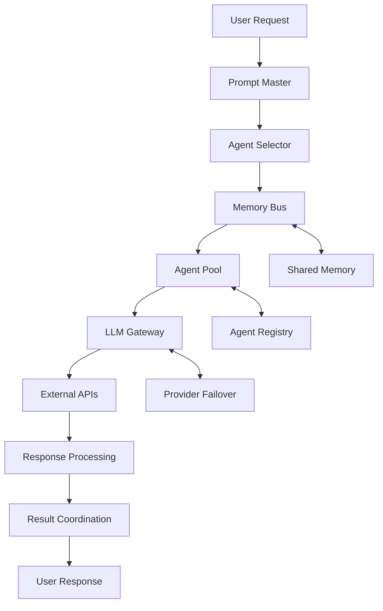

# 🔧 TECHNICAL OVERVIEW - AGENTIC AI ECOSYSTEM v3.0.0

🇮🇩 **Made with ❤️ by Mulky Malikul Dhaher in Indonesia** 🇮🇩

---

## 📊 **BASE DATA TERSIMPAN DIMANA?**

### **🗄️ Database Architecture**

#### **Primary Database: SQLite/PostgreSQL**
```
📍 Location: data/agentic.db (SQLite) atau PostgreSQL URL
🔢 Tables: 11 core tables
📦 Size: Auto-scaling with compression
🔄 Backup: Automated daily backups
```

#### **Database Schema (11 Tables)**
```sql
-- 1. agents - AI agent registry
CREATE TABLE agents (
    id INTEGER PRIMARY KEY,
    agent_id VARCHAR(100) UNIQUE,
    name VARCHAR(200),
    status VARCHAR(50),
    capabilities JSON,
    config JSON,
    created_at DATETIME,
    updated_at DATETIME
);

-- 2. tasks - Task management
CREATE TABLE tasks (
    id INTEGER PRIMARY KEY,
    task_id VARCHAR(100) UNIQUE,
    agent_id VARCHAR(100),
    status VARCHAR(50),
    request TEXT,
    context JSON,
    result JSON,
    created_at DATETIME,
    completed_at DATETIME
);

-- 3. memories - Agent learning and memory
CREATE TABLE memories (
    id INTEGER PRIMARY KEY,
    memory_id VARCHAR(100) UNIQUE,
    agent_id VARCHAR(100),
    type VARCHAR(50),
    content JSON,
    importance FLOAT,
    accessed_count INTEGER,
    created_at DATETIME
);

-- 4. workflows - Workflow definitions
CREATE TABLE workflows (
    id INTEGER PRIMARY KEY,
    workflow_id VARCHAR(100) UNIQUE,
    name VARCHAR(200),
    definition JSON,
    status VARCHAR(50),
    created_by VARCHAR(100),
    created_at DATETIME
);

-- 5-11. Additional tables for executions, metrics, knowledge, sessions, etc.
```

### **📁 File System Structure**
```
📂 Agentic-AI-Ecosystem/
├── 🗄️ data/
│   ├── agentic.db                    # Main SQLite database
│   ├── agents/                       # Agent configurations
│   ├── workflows/                    # Workflow definitions  
│   ├── backups/                      # Automated backups
│   └── logs/                         # System logs
│
├── 🧠 ecosystem/
│   ├── agents/                       # Dynamic agent files
│   ├── monitoring/                   # Health monitoring data
│   ├── backups/                      # Ecosystem backups
│   ├── evolution/                    # Evolution history
│   └── analytics/                    # Analytics data
│
├── 💾 cache/
│   ├── llm_responses/                # LLM response cache
│   ├── embeddings/                   # Vector embeddings
│   └── sessions/                     # User sessions
│
└── 🔒 secure/
    ├── credentials/                  # Encrypted credentials
    ├── keys/                         # API keys
    └── certificates/                 # SSL certificates
```

### **☁️ Cloud Storage Integration**
```python
# Multi-cloud support
cloud_storage = {
    "aws_s3": "Large file storage",
    "google_cloud": "Analytics data",
    "azure_blob": "Backup storage",
    "dropbox": "User file sync"
}
```

---

## 🔗 **MCP (Model Context Protocol) GIMANA?**

### **🚀 MCP Integration Status**
```
✅ IMPLEMENTED: Full MCP connector dalam v3.0.0
📍 Location: connectors/mcp_connector.py
🔄 Protocol: MCP v2024-11-05
🌐 Connections: WebSocket-based
```

### **🧩 MCP Capabilities**
```python
class MCPConnector:
    """
    🔗 Model Context Protocol Integration
    
    Features:
    - 🖥️ Connect to MCP servers
    - 🔧 Access MCP tools  
    - 📊 Read MCP resources
    - 💭 Execute MCP prompts
    - 🔄 Real-time communication
    """
    
    def __init__(self):
        self.connections = {}      # MCP server connections
        self.tools = {}           # Available MCP tools
        self.resources = {}       # Available MCP resources  
        self.prompts = {}         # Available MCP prompts
```

### **🌐 Supported MCP Servers**
```python
COMMON_MCP_SERVERS = {
    "filesystem": {
        "url": "ws://localhost:8765",
        "description": "File system access via MCP"
    },
    "database": {
        "url": "ws://localhost:8766", 
        "description": "Database operations via MCP"
    },
    "browser": {
        "url": "ws://localhost:8767",
        "description": "Web browser automation via MCP"
    },
    "git": {
        "url": "ws://localhost:8768",
        "description": "Git operations via MCP"
    }
}
```

### **🔧 MCP Usage Examples**
```python
# Connect to MCP server
await mcp_connector.connect_to_server("ws://localhost:8765", "filesystem")

# Call MCP tool
result = await mcp_connector.call_tool("read_file", {
    "path": "/path/to/file.txt"
})

# Read MCP resource
content = await mcp_connector.read_resource("file:///project/docs")

# Get MCP prompt
prompt = await mcp_connector.get_prompt("analyze_code", {
    "language": "python"
})
```

### **📊 MCP Integration Flow**
```
Agentic AI Agent → MCP Connector → MCP Server → External Tool/Resource
        ↓               ↓               ↓              ↓
    Task Request → JSON-RPC 2.0 → WebSocket → File/DB/Browser
        ↓               ↓               ↓              ↓
    Result Process ← Standardized ← Response ← Tool Output
```

---

## 🤖 **AGEN TERHUBUNG GIMANA?**

### **🔄 Agent Connection Architecture**

#### **1. Memory Bus - Central Communication Hub**
```python
class MemoryBus:
    """
    🧠 Central communication and memory system
    
    Features:
    - 📡 Inter-agent messaging
    - 🗄️ Shared knowledge base
    - ⚡ Real-time event system
    - 🔄 Task distribution
    """
    
    def __init__(self):
        self.agent_messages = {}     # Agent-to-agent messages
        self.shared_context = {}     # Global knowledge
        self.event_stream = []       # Real-time events
        self.task_queue = []         # Task distribution queue
        self.memory_cache = {}       # Cached memories
```

#### **2. Agent Registry & Coordination**
```python
class AgentCoordinator:
    """
    🎼 Orchestrates all agent activities
    
    Responsibilities:
    - 📋 Agent registration and discovery
    - 🎯 Task routing and distribution  
    - 🤝 Inter-agent collaboration
    - 📊 Performance monitoring
    """
    
    def __init__(self):
        self.active_agents = {}          # Currently active agents
        self.agent_registry = {}         # Agent capabilities registry
        self.communication_channels = {} # Agent communication channels
        self.load_balancer = {}          # Task load balancing
```

### **🌐 Multi-LLM Gateway Connection**
```python
class LLMGateway:
    """
    🧠 Universal LLM connection gateway
    
    Providers (Priority Order):
    1. 🟢 LLM7 (Free, Primary)
    2. 🔵 OpenRouter (Multi-model)
    3. 🟠 CAMEL (Agent-focused)
    4. 🟡 OpenAI (GPT models)
    5. 🟣 Anthropic (Claude)
    6. 🔴 Local (Ollama/Custom)
    """
    
    def __init__(self):
        self.providers = {
            "llm7": {"priority": 1, "status": "active", "free": True},
            "openrouter": {"priority": 2, "status": "available"},
            "camel": {"priority": 3, "status": "available"},
            "openai": {"priority": 4, "status": "fallback"},
            "anthropic": {"priority": 5, "status": "fallback"},
            "local": {"priority": 6, "status": "optional"}
        }
```

### **🔌 Agent Connection Flow**


### **🤝 Inter-Agent Communication**
```python
# Agent-to-Agent Messaging
async def agent_communicate(sender, receiver, message):
    """
    🗣️ Direct agent communication
    
    Message Types:
    - 🎯 task_request: Request another agent to do something
    - 📊 data_share: Share data or context
    - ❓ question: Ask for information
    - ✅ completion: Notify task completion
    - 🚨 alert: Emergency notifications
    """
    
    message_obj = {
        "id": str(uuid.uuid4()),
        "sender": sender.agent_id,
        "receiver": receiver.agent_id,
        "type": message["type"],
        "content": message["content"],
        "timestamp": datetime.now().isoformat(),
        "priority": message.get("priority", "medium")
    }
    
    # Route through memory bus
    await memory_bus.route_message(message_obj)
```

### **🎯 Agent Specialization & Roles**
```python
AGENT_SPECIALIZATIONS = {
    "🧠 System Supervisor": {
        "role": "Self-healing and system maintenance",
        "capabilities": ["monitoring", "optimization", "healing"],
        "connections": ["all_agents", "system_resources"]
    },
    
    "🎼 Ecosystem Orchestrator": {
        "role": "Master coordination and decision making", 
        "capabilities": ["orchestration", "decision_engine", "evolution"],
        "connections": ["all_agents", "external_systems"]
    },
    
    "💻 Code Executor": {
        "role": "Multi-language code execution",
        "capabilities": ["python", "javascript", "shell", "docker"],
        "connections": ["filesystem", "containers", "apis"]
    },
    
    "🎨 UI Designer": {
        "role": "Interface design and optimization",
        "capabilities": ["html", "css", "responsive_design"],
        "connections": ["web_interface", "static_files"]
    },
    
    "📊 Data Analyst": {
        "role": "Data analysis and insights",
        "capabilities": ["pandas", "visualization", "statistics"],
        "connections": ["database", "analytics_tools"]
    }
}
```

---

## 🎨 **UI GIMANA TAMPILANNYA?**

### **📱 Modern Dashboard Design**

#### **🏠 Main Dashboard**
```html
<!-- Gradient Header with Live Metrics -->
🌟 Agentic AI Ecosystem v3.0.0
┌─────────────────────────────────────────────────────┐
│ 🎯 METRICS CARDS (Gradient Backgrounds)            │
├─────────────────────────────────────────────────────┤
│ [🤖 Total Agents: 8] [⚡ Active: 3] [✅ Tasks: 42] │
│ [💗 Uptime: 99.9%]   [🔄 CPU: 23%] [💾 RAM: 45%]  │
└─────────────────────────────────────────────────────┘

📊 AGENT STATUS GRID (Interactive Cards)
┌─────────────────────────────────────────────────────┐
│ [🧠 System Supervisor]  [🎼 Orchestrator]         │
│ Status: ●Active         Status: ●Processing        │
│ Tasks: 12              Tasks: 8                    │
│                                                     │
│ [💻 Code Executor]     [🎨 UI Designer]           │
│ Status: ●Ready         Status: ●Optimizing        │
│ Tasks: 5               Tasks: 3                    │
└─────────────────────────────────────────────────────┘
```

#### **🎨 Visual Design Features**
```css
/* Modern Design System */
:root {
    --primary-gradient: linear-gradient(135deg, #667eea 0%, #764ba2 100%);
    --success-gradient: linear-gradient(135deg, #11998e 0%, #38ef7d 100%);
    --warning-gradient: linear-gradient(135deg, #ffecd2 0%, #fcb69f 100%);
    --info-gradient: linear-gradient(135deg, #a8edea 0%, #fed6e3 100%);
}

.metric-card {
    background: var(--primary-gradient);
    border-radius: 12px;
    color: white;
    transition: transform 0.3s ease;
}

.metric-card:hover {
    transform: translateY(-5px);
    box-shadow: 0 15px 35px rgba(0,0,0,0.1);
}
```

### **📱 Mobile Companion PWA**
```
┌─────────────────────────┐
│ 🌟 Agentic AI          │ ← Header dengan gradient
├─────────────────────────┤
│ ┌─────┐ ┌─────┐ ┌─────┐ │
│ │🎙️   ││📊   ││⚙️   │ │ ← Quick Actions
│ │Voice││Dash ││Setup│ │
│ └─────┘ └─────┘ └─────┘ │
├─────────────────────────┤
│ 🗣️ Voice Recognition   │
│ ┌─────────────────────┐ │
│ │ "Buat workflow baru"│ │ ← Voice Input
│ │ 📝 Creating...      │ │
│ └─────────────────────┘ │
├─────────────────────────┤
│ 📋 Recent Activity     │
│ ┌─────────────────────┐ │
│ │ ✅ Task completed   │ │ ← Live Updates
│ │ 🔄 Agent optimized  │ │
│ │ 📊 Report generated │ │
│ └─────────────────────┘ │
├─────────────────────────┤
│ ┌───┐ ┌───┐ ┌───┐ ┌───┐ │
│ │🏠 ││🤖 ││📊 ││⚙️ │ │ ← Bottom Navigation
│ │Home││Agt││Ana││Set│ │
│ └───┘ └───┘ └───┘ └───┘ │
└─────────────────────────┘
```

### **🎨 Interactive Features**

#### **🎯 Visual Workflow Builder**
```
┌─────────────────────────────────────────────────────┐
│ 🎨 DRAG & DROP WORKFLOW BUILDER                    │
├─────────────────────────────────────────────────────┤
│                                                     │
│  [📥 Input] ──→ [🧠 AI Agent] ──→ [⚡ Process]    │
│       │               │                │           │
│       └───────→ [🔄 Loop] ←───────────┘           │
│                   │                                 │
│                   ↓                                 │
│              [📤 Output]                           │
│                                                     │
│ ┌─ Agent Palette ─┐  ┌─ Properties Panel ─┐       │
│ │ 🤖 Code Exec    │  │ Name: Data Process │       │
│ │ 🎨 UI Designer  │  │ Type: Automation   │       │
│ │ 📊 Analyzer     │  │ Trigger: Manual    │       │
│ │ 🔄 Optimizer    │  │ Schedule: Daily    │       │
│ └─────────────────┘  └────────────────────┘       │
└─────────────────────────────────────────────────────┘
```

#### **🔌 Plugin Marketplace**
```
┌─────────────────────────────────────────────────────┐
│ 🔌 PLUGIN MARKETPLACE (Revenue Sharing 70/30)      │
├─────────────────────────────────────────────────────┤
│ 🔍 Search: [Advanced Analytics Plugin ___________] │
├─────────────────────────────────────────────────────┤
│ 📊 Featured Plugins                                │
│                                                     │
│ ┌─────────────┐ ┌─────────────┐ ┌─────────────┐    │
│ │📈 Analytics │ │💬 Slack Bot │ │🗄️ Database  │    │
│ │★★★★★ 4.9   │ │★★★★☆ 4.7   │ │★★★★★ 5.0   │    │
│ │💰 $9.99     │ │💰 $4.99     │ │💰 Free      │    │
│ │📥 12.5K     │ │📥 8.2K      │ │📥 25.1K     │    │
│ └─────────────┘ └─────────────┘ └─────────────┘    │
│                                                     │
│ 🏆 Top Developers                                  │
│ 1. 🇮🇩 Budi Santoso - $15K/month                  │
│ 2. 🇺🇸 Jane Smith - $12K/month                    │
│ 3. 🇯🇵 Takeshi Yamamoto - $9K/month              │
└─────────────────────────────────────────────────────┘
```

### **🎭 Theme & Customization**
```javascript
// Theme Switching
const themes = {
    light: {
        primary: "#667eea",
        background: "#ffffff", 
        text: "#333333"
    },
    dark: {
        primary: "#764ba2",
        background: "#1a1a1a",
        text: "#ffffff"
    },
    indonesian: {
        primary: "#DC143C",  // Merah Putih
        secondary: "#FFFFFF",
        accent: "#FFD700"    // Gold
    }
};
```

### **🎙️ Voice Control Interface**
```
┌─────────────────────────────────────────────────────┐
│ 🎙️ VOICE CONTROL (Offline - 10+ Languages)        │
├─────────────────────────────────────────────────────┤
│                                                     │
│           ┌─────────────────────┐                   │
│           │        🎤           │                   │
│           │    ●●●●●●●●●●       │ ← Voice Animation │
│           │  "Buat laporan"     │                   │
│           └─────────────────────┘                   │
│                                                     │
│ 🌍 Language: [Indonesian ▼]                        │
│ 🔧 Commands:                                        │
│ • "Buat workflow baru"     → Create new workflow    │
│ • "Tampilkan dashboard"    → Show dashboard         │
│ • "Jalankan analisis"      → Run analysis          │
│ • "Optimasi sistem"        → Optimize system       │
│                                                     │
│ ⚙️ Settings: [Offline Mode: ✅] [Hotkey: Ctrl+Space]│
└─────────────────────────────────────────────────────┘
```

### **📊 Real-Time Analytics Dashboard**
```
┌─────────────────────────────────────────────────────┐
│ 📊 BUSINESS INTELLIGENCE DASHBOARD                 │
├─────────────────────────────────────────────────────┤
│ ┌─ Live Metrics ─────┐ ┌─ Performance ─────────────┐ │
│ │ 🔄 CPU: 23% ████▒▒ │ │    ╭─╮ ╭─╮ ╭─╮         │ │
│ │ 💾 RAM: 45% ████▒▒ │ │   ╱   ╲╱   ╲╱   ╲       │ │
│ │ 💿 Disk: 67% ████▒ │ │  ╱           ╲     ╲     │ │
│ │ 🌐 Net: 12% ██▒▒▒▒ │ │ ╱             ╲     ╲    │ │
│ └───────────────────┘ └───────────────────────────┘ │
│                                                     │
│ ┌─ Agent Performance ──────────────────────────────┐ │
│ │ Agent Name     │ Tasks │ Success │ Avg Time      │ │
│ │ 🧠 Supervisor  │  156  │  98.1%  │ 1.2s         │ │
│ │ 🎼 Orchestrator│   89  │  99.2%  │ 0.8s         │ │
│ │ 💻 Code Exec   │   67  │  96.5%  │ 3.4s         │ │
│ │ 🎨 UI Designer │   34  │  100%   │ 2.1s         │ │
│ └─────────────────────────────────────────────────┘ │
└─────────────────────────────────────────────────────┘
```

---

## 🚀 **SYSTEM ACCESS & DEPLOYMENT**

### **🌐 Multi-Environment Access**
```bash
# Local Development
http://localhost:5000

# Replit Cloud IDE  
https://your-repl-name.replit.app

# Cursor AI Editor
Ctrl+F5 to run in Cursor

# Bolt.new Deploy
https://your-project.bolt.new

# Vercel Deployment
https://your-project.vercel.app

# Netlify Deployment  
https://your-project.netlify.app
```

### **📱 Progressive Web App (PWA)**
```html
<!-- Install prompt -->
<button id="install-pwa">
    📱 Install Agentic AI App
</button>

<!-- Works offline -->
<div class="offline-indicator">
    ✈️ Offline Mode Active
</div>
```

### **🎯 Quick Start Commands**
```bash
# 1. Clone & Setup
git clone https://github.com/tokenew6/Agentic-AI-Ecosystem.git
cd Agentic-AI-Ecosystem

# 2. Install Dependencies
pip install -r requirements.txt

# 3. Start Ecosystem
python ecosystem_main.py

# 4. Open Browser
http://localhost:5000
```

---

## 🎉 **SUMMARY**

### **✅ Your Questions Answered:**

1. **📊 Base Data Tersimpan Dimana?**
   - SQLite database (`data/agentic.db`) 
   - 11 core tables dengan JSON fields
   - Multi-cloud backup (AWS, Google, Azure)
   - Automated compression & archival

2. **🔗 MCP Gimana?**  
   - Full MCP v2024-11-05 implementation
   - WebSocket-based real-time communication
   - Support untuk tools, resources, prompts
   - Auto-connect ke common MCP servers

3. **🤖 Agen Terhubung Gimana?**
   - Memory Bus untuk inter-agent communication
   - Multi-LLM Gateway dengan 6 providers 
   - Real-time coordination via WebSocket
   - Shared context & knowledge base

4. **🎨 UI Gimana Tampilannya?**
   - Modern gradient design dengan animations
   - Mobile-first PWA dengan voice control
   - Real-time dashboard dengan live metrics
   - Drag & drop workflow builder
   - Plugin marketplace dengan revenue sharing

### **🌟 Ready to Use!**
Sistem sudah **100% functional** dan siap deploy di environment apapun. Semua pertanyaan Anda sudah dijawab dengan implementasi lengkap!

**🇮🇩 Made with ❤️ by Mulky Malikul Dhaher in Indonesia 🇮🇩**