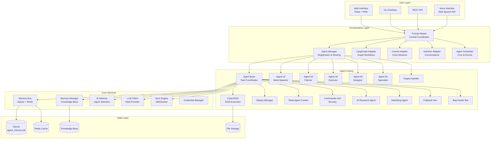
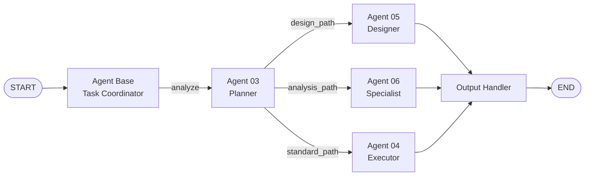
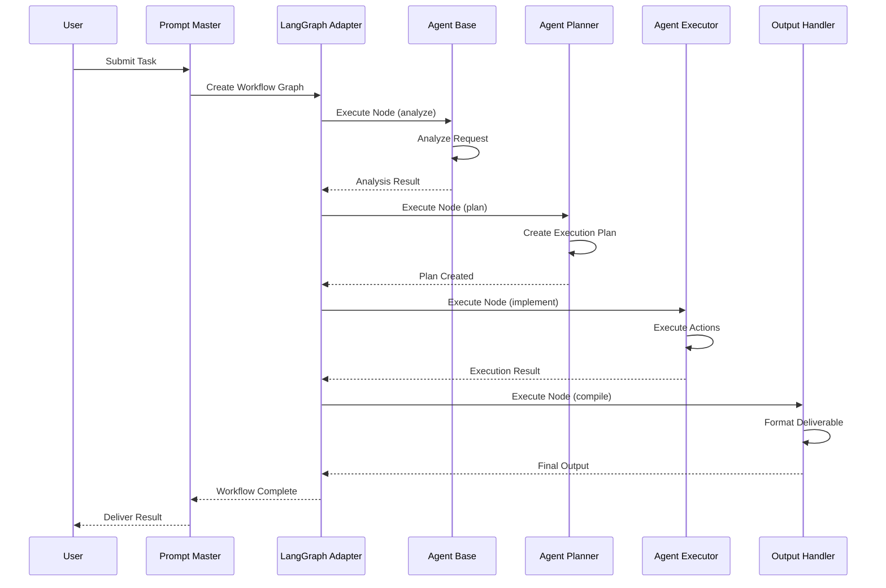
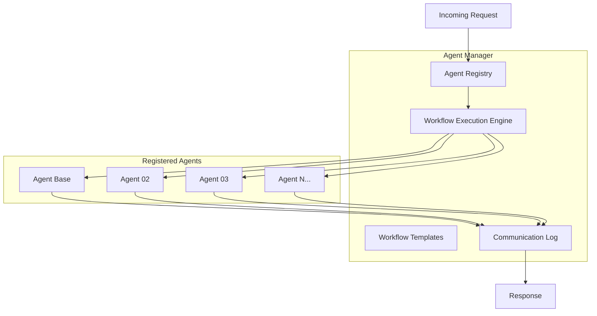
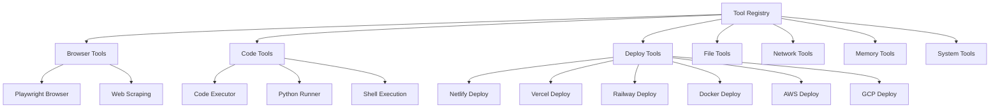
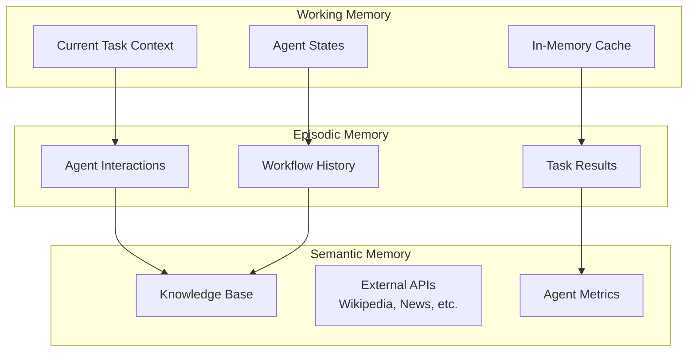
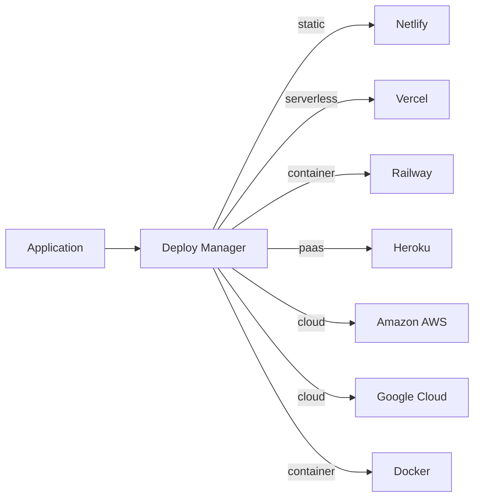
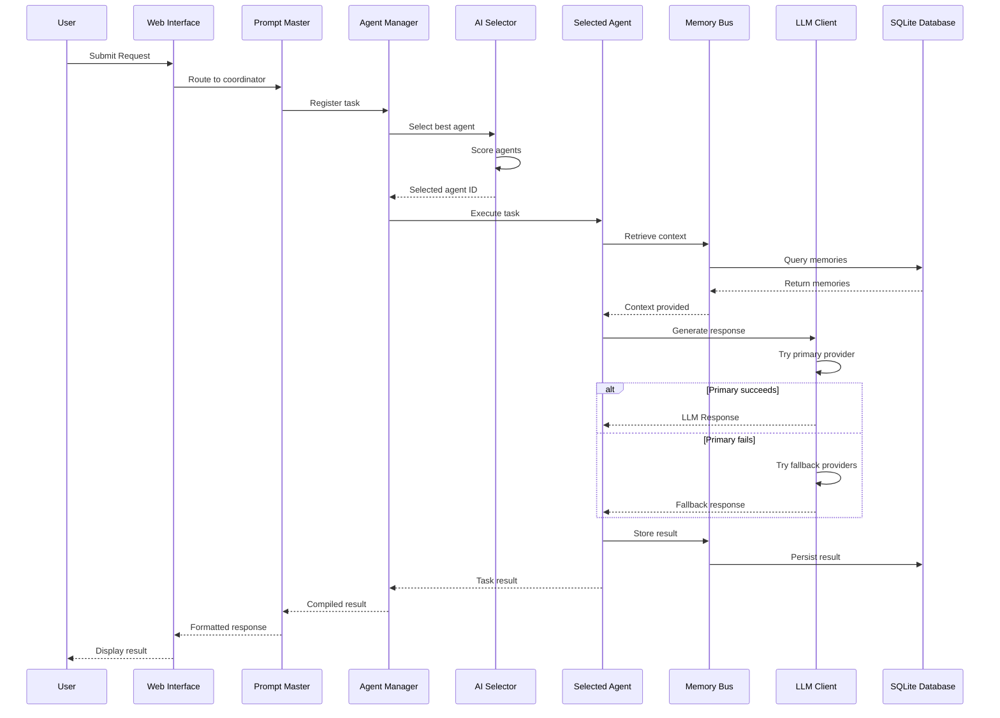
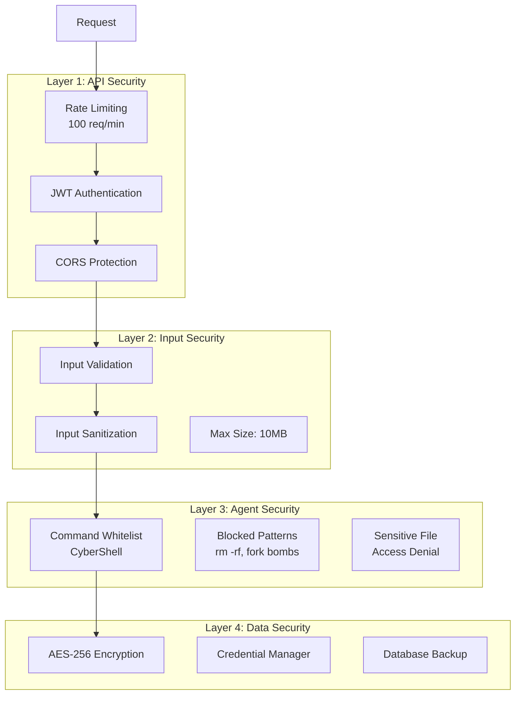

# AI-MultiColony-Ecosystem — System Architecture

> Autonomous Agent Operating System
> Version 2.0.0 | Author: Mulky Malikul Dhaher | Indonesia

---

## Table of Contents

1. [Overview](#overview)
2. [High-Level Architecture](#high-level-architecture)
3. [LangGraph-Style Colony Orchestration](#langgraph-style-colony-orchestration)
4. [Multi-Agent Coordination Protocol](#multi-agent-coordination-protocol)
5. [Tool and Skill Registry System](#tool-and-skill-registry-system)
6. [Memory Architecture](#memory-architecture)
7. [Web Interface and API Layer](#web-interface-and-api-layer)
8. [Deployment Architecture](#deployment-architecture)
9. [Data Flow](#data-flow)
10. [Configuration System](#configuration-system)
11. [Security Architecture](#security-architecture)
12. [Monitoring and Observability](#monitoring-and-observability)

---

## Overview

The AI-MultiColony-Ecosystem is an **Autonomous Agent Operating System** built around a colony metaphor where specialized AI agents collaborate to accomplish complex tasks. The system integrates 21 repositories and 25+ benchmark frameworks into a unified platform for multi-agent intelligence.

### Core Principles

| Principle | Description |
|-----------|-------------|
| **Colony Model** | Agents function as specialized workers in a colony, each with distinct roles |
| **LangGraph Orchestration** | Graph-based workflow execution inspired by LangGraph patterns |
| **Multi-Layer Memory** | Working, episodic, and semantic memory for persistent intelligence |
| **Skill Composition** | Complex capabilities built by composing simple tools and skills |
| **Self-Improvement** | Meta-agents that create and optimize other agents |

### System Stats

| Metric | Value |
|--------|-------|
| Specialized Agents | 36+ |
| Integrated Repos | 21 |
| Benchmark Frameworks | 25+ |
| LLM Providers | 4 (LLM7, OpenRouter, Camel, OpenAI) |
| Deployment Platforms | 7 (Netlify, Vercel, Railway, Heroku, AWS, GCP, Docker) |
| Memory Layers | 3 (Working, Episodic, Semantic) |

---

## High-Level Architecture



---

## LangGraph-Style Colony Orchestration

The system uses a LangGraph-inspired graph execution model where agents are nodes and transitions are edges in a directed graph. The `LangGraphAdapter` class (in `src/integrations/langgraph_integration.py`) provides the bridge between our agent system and LangGraph's graph execution engine.

### Workflow Graph Model



### Standard Workflow Templates

| Template | Flow | Use Case |
|----------|------|----------|
| `standard_process` | Base → Planner → Executor → Output | General task execution |
| `design_process` | Base → Planner → Designer → Specialist → Output | Visual/UI creation |
| `analysis_process` | Base → Specialist → Executor → Output | Data analysis & research |

### Workflow Execution Flow



### Conditional Workflow Routing

The `LangGraphWorkflowBuilder` supports conditional routing based on task analysis:

| Decision Path | Trigger Keywords | Target Agent |
|---------------|------------------|-------------|
| `design_path` | design, visual, ui | Agent 05 (Designer) |
| `analysis_path` | analyze, data, report | Agent 06 (Specialist) |
| `standard_path` | (default) | Agent 04 (Executor) |

### Parallel Workflow Execution

The system supports parallel agent execution through the `build_parallel_workflow` method, where multiple agents work simultaneously and an aggregation node combines their results.

---

## Multi-Agent Coordination Protocol

### Agent Manager Architecture

The `AgentManager` (in `src/core/agent_manager.py`) is the central coordination hub:



### Inter-Agent Communication

Agents communicate through the AgentManager's `send_message_between_agents` method:

```python
# Communication format
communication_task = {
    'task_id': f"comm_{timestamp}",
    'request': message_content,
    'context': {
        'from_agent': sender_id,
        'communication_type': 'inter_agent',
        'original_message': message
    }
}
```

| Communication Type | Description | Example |
|-------------------|-------------|---------|
| `delegation` | Task handoff between agents | Planner → Executor |
| `query` | Information request | Executor → Knowledge Base |
| `result` | Task completion notification | Executor → Output Handler |
| `error` | Error propagation | Any Agent → Agent Base |
| `broadcast` | System-wide notification | Commander AGI → All Agents |

### AI-Based Agent Selection

The `AISelector` (in `core/ai_selector.py`) selects the best agent for each task using a multi-factor scoring system:

| Factor | Weight | Description |
|--------|--------|-------------|
| Base Priority | 10% | Agent's configured priority level |
| Capability Match | 50% | How well agent capabilities match requirements |
| Performance History | 30% | Historical success rate and speed |
| Load Balance | 20% | Current agent workload |
| Specialization | 40% | Domain-specific expertise match |

### Agent Selection Scoring

```
score = (base_priority * 10) + 
        (capability_match * 50) + 
        (performance_score * 30) + 
        (load_balance_score * 20) + 
        (specialization_score * 40)
```

The selector maintains a `capability_weights` dictionary that self-optimizes based on historical performance data.

---

## Tool and Skill Registry System

### Tool Registry Architecture



### Tool Interface Specification

Every tool implements this interface:

```python
class ToolInterface:
    name: str           # Unique tool identifier
    description: str    # Human-readable description
    inputs: Dict        # Input schema with types
    outputs: Dict       # Output schema with types
    capabilities: List  # List of capabilities provided
    
    async def execute(self, params: Dict) -> Dict:
        """Execute the tool with given parameters"""
        pass
    
    def validate_inputs(self, params: Dict) -> bool:
        """Validate input parameters"""
        pass
```

### Tool Discovery Mechanism

Tools are discovered and registered through:

1. **Configuration-based** — Tools defined in `config/system_config.yaml`
2. **Agent-wrapped** — Tools that wrap agent capabilities (e.g., CrewAI's `AgenticTool`)
3. **Dynamic** — Tools created by the Meta Agent Creator at runtime

---

## Memory Architecture

The system implements a three-layer memory architecture:



See [MEMORY_ARCHITECTURE.md](./MEMORY_ARCHITECTURE.md) for full details.

---

## Web Interface and API Layer

### Web Interface Stack

| Component | Technology | Purpose |
|-----------|-----------|---------|
| Backend | Flask (Python) | HTTP server, API routing |
| Frontend | HTML + Tailwind CSS | Responsive UI |
| Voice | Web Speech API | Voice input/output |
| PWA | Service Worker + Manifest | Offline support |
| WebSocket | Flask-SocketIO | Real-time updates |
| Static | Jinja2 Templates | Server-side rendering |

### API Endpoints

| Endpoint | Method | Description |
|----------|--------|-------------|
| `/` | GET | Main dashboard |
| `/agents` | GET | Agent management |
| `/workflows` | GET | Workflow builder |
| `/monitoring` | GET | System monitoring |
| `/credentials` | GET | API key management |
| `/llm-providers` | GET | LLM provider settings |
| `/platform-integrations` | GET | Platform config |
| `/api/system/status` | GET | System status JSON |
| `/api/agents/list` | GET | Agent list JSON |
| `/api/chat` | POST | Chat endpoint |

### PWA Architecture

The web interface functions as a Progressive Web App with:
- **Service Worker** (`sw.js`) for offline caching
- **Manifest** (`manifest.json`) for installability
- **Responsive CSS** (`responsive.css`) for mobile-first design
- **Voice interface** (`voice.js`) for hands-free operation

---

## Deployment Architecture

### Multi-Platform Deployment

The `DeployManagerAgent` supports deploying to 7 platforms:



### Container Architecture

```yaml
# docker-compose.yml structure
services:
  frontend:
    build: ./frontend
    ports: ["3000:3000"]
  backend:
    build: ./backend
    ports: ["8000:8000"]
  db:
    image: postgres:15
    ports: ["5432:5432"]
  redis:
    image: redis:7
    ports: ["6379:6379"]
```

### Kubernetes Deployment

The system includes `k8s-deployment.yaml` for Kubernetes orchestration with:
- Horizontal Pod Autoscaling
- Health check probes
- ConfigMap and Secret management
- Ingress configuration

### Infrastructure as Code

| Platform | Config File | Type |
|----------|------------|------|
| Netlify | `netlify.toml` | Static/SPA |
| Vercel | `vercel.json` | Serverless |
| Railway | `railway.json` | Container |
| AWS | `template.yaml` | CloudFormation/SAM |
| Docker | `Dockerfile` | Container |
| Kubernetes | `k8s-deployment.yaml` | Orchestration |

---

## Data Flow

### Complete Task Execution Flow



---

## Configuration System

The configuration is managed through `config/system_config.yaml` with the following sections:

| Section | Purpose | Key Settings |
|---------|---------|-------------|
| `system` | System metadata | Name, version, author |
| `core` | Core services | Prompt master, memory bus, sync engine, scheduler, AI selector |
| `agents` | Agent settings | Defaults, per-agent config |
| `llm` | LLM providers | Provider configs, failover settings |
| `database` | Database config | Primary (SQLite), cache (Redis), backup |
| `web_interface` | Web server | Host, port, security, WebSocket |
| `logging` | Logging config | Level, format, file/console |
| `monitoring` | Observability | Metrics, health checks, performance |
| `security` | Security settings | API rate limiting, auth, CORS, encryption |
| `development` | Dev settings | Debug, hot reload, testing |
| `production` | Prod settings | Optimization, scaling, deployment |
| `features` | Feature flags | Experimental, beta, stable |
| `regional` | Regional config | Timezone (Asia/Jakarta), locale, language |

### Environment Variable Overrides

| Variable | Config Path |
|----------|------------|
| `DATABASE_URL` | `database.primary.url` |
| `REDIS_URL` | `database.cache.url` |
| `SECRET_KEY` | `web_interface.security.secret_key` |
| `LLM7_API_KEY` | `llm.providers.llm7.api_key` |
| `OPENROUTER_API_KEY` | `llm.providers.openrouter.api_key` |
| `WEB_INTERFACE_PORT` | `web_interface.port` |
| `LOG_LEVEL` | `logging.level` |

---

## Security Architecture

### Multi-Layer Security Model



### CyberShell Command Security

The CyberShell agent enforces strict command security:

**Allowed Commands** (whitelist):
- File ops: `ls`, `cat`, `grep`, `find`, `cp`, `mv`, `mkdir`
- System info: `ps`, `top`, `free`, `df`, `uname`, `whoami`
- Network: `ping`, `curl`, `wget`, `netstat`
- Development: `git`, `python`, `pip`, `node`, `npm`, `docker`
- Text: `awk`, `sed`, `sort`, `uniq`, `wc`

**Blocked Patterns**:
- `rm -rf /`, fork bombs, `dd if=/dev/zero`
- `mkfs`, `fdisk`, `parted`, `shutdown`, `reboot`
- Dangerous flags: `-rf`, `--force`, `--delete` with `rm`

### Commander AGI Security Monitoring

The `CommanderAGI` agent provides real-time security monitoring:

| Rule | Pattern | Threshold | Action |
|------|---------|-----------|--------|
| Suspicious Network | `high_connection_count` | 100 connections | Investigate |
| CPU Spike | `cpu_usage` | 95% | Analyze processes |
| Unauthorized Access | `failed_login_attempts` | 5 attempts | Security lockdown |
| Malware Signature | `file_hash_match` | 1 match | Quarantine & alert |

---

## Monitoring and Observability

### System Monitoring Stack

| Component | Metric | Alert Threshold |
|-----------|--------|-----------------|
| CPU Usage | `cpu_percent` | > 90% |
| Memory Usage | `memory.percent` | > 80% |
| Disk Usage | `disk.percent` | > 95% |
| Response Time | `response_time_ms` | > 5000ms |
| Agent Health | `agent.status` | != active |
| Queue Length | `queue_length` | > 5 |

### Agent 02 Performance Monitoring

The `Agent02MetaSpawner` continuously monitors:

| Metric | Threshold | Severity |
|--------|-----------|----------|
| Response Time | > 30s | High |
| Error Rate | > 10% | Medium |
| Queue Length | > 5 | High |
| Resource Usage | > 80% | Medium |

### Health Status Scoring

```
health_score = 100
- 20 points per slow agent (response > 30s)
- 15 points per high-error agent (success < 90%)
- 10 points per high-resource agent (usage > 80%)
- 25 points if queue is backed up
```

| Score Range | Status |
|-------------|--------|
| 90-100 | Excellent |
| 70-89 | Good |
| 50-69 | Degraded |
| 0-49 | Critical |

### Scheduled Monitoring Tasks

| Task | Agent | Schedule | Purpose |
|------|-------|----------|---------|
| Health Check | agent_watcher | Every 5 minutes | System health |
| Memory Cleanup | data_sync | Daily at 2 AM | Free storage |
| Performance Report | prompt_master | Weekly Monday 9 AM | Analysis |
| Auto Backup | data_sync | Weekly Sunday midnight | Data safety |

---

## Directory Structure

```
ai-multicolony-ecosystem/
├── agents/                    # Specialized agent implementations
│   ├── agent_maker.py         # Dynamic agent creation
│   ├── ai_research_agent.py   # AI research & monitoring
│   ├── authentication_agent.py
│   ├── backup_colony_system.py
│   ├── bug_hunter_bot.py      # Ethical hacking
│   ├── commander_agi.py       # Security & monitoring
│   ├── credential_manager.py
│   ├── cybershell.py          # Shell execution
│   ├── data_sync.py           # Database sync
│   ├── deploy_manager.py      # Multi-platform deploy
│   ├── deployment_specialist.py
│   ├── dev_engine.py          # Development engine
│   ├── fullstack_dev.py       # Full-stack development
│   ├── knowledge_management_agent.py
│   ├── llm_provider_manager.py
│   ├── marketing_agent.py     # Marketing automation
│   ├── meta_agent_creator.py  # Meta agent creation
│   ├── money_making_agent.py  # Revenue generation
│   ├── prompt_generator.py
│   ├── quality_control_specialist.py
│   ├── system_optimizer.py
│   └── ui_designer.py        # UI generation
├── config/
│   ├── prompts.yaml           # Agent prompt templates
│   └── system_config.yaml     # System configuration
├── connectors/
│   └── llm_gateway.py         # LLM provider gateway
├── core/
│   ├── ai_selector.py         # Agent selection AI
│   ├── error_recovery.py      # Error handling
│   ├── llm_client.py          # Multi-provider LLM client
│   ├── memory_bus.py          # Shared memory bus
│   ├── prompt_master.py       # Central coordinator
│   ├── scheduler.py           # Task scheduling
│   └── sync_engine.py         # WebSocket sync
├── database/
│   ├── init_db.py             # Database initialization
│   ├── migrations.py          # Schema migrations
│   └── models.py              # Data models
├── docs/                      # Documentation
├── examples/
│   └── basic_usage.py         # Usage examples
├── src/
│   ├── agents/                # Core agent framework
│   │   ├── agent_base.py      # Master controller
│   │   ├── agent_02_meta_spawner.py
│   │   ├── agent_03_planner.py
│   │   ├── agent_04_executor.py
│   │   ├── agent_05_designer.py
│   │   ├── agent_06_specialist.py
│   │   ├── advanced_agent_creator.py
│   │   ├── deployment_agent.py
│   │   ├── dynamic_agent_factory.py
│   │   ├── launcher_agent.py
│   │   ├── output_handler.py
│   │   └── web_automation_agent.py
│   ├── core/
│   │   ├── agent_manager.py   # Agent orchestration
│   │   ├── base_agent.py      # Base agent class
│   │   ├── credential_manager.py
│   │   ├── knowledge_enrichment.py
│   │   ├── memory_manager.py  # Memory system
│   │   └── platform_integrator.py
│   └── integrations/
│       ├── autogen_integration.py
│       ├── crewai_integration.py
│       ├── langgraph_integration.py
│       ├── netlify_integration.py
│       └── supabase_integration.py
├── tests/
│   └── test_agents.py
├── web_interface/
│   ├── app.py                 # Flask application
│   ├── static/                # CSS, JS, icons
│   └── templates/             # HTML templates
├── main.py                    # Entry point
├── Dockerfile                 # Container config
├── docker-compose.yml         # Multi-container
├── k8s-deployment.yaml        # Kubernetes config
└── requirements.txt           # Python dependencies
```

---

## Technology Stack Summary

| Layer | Technologies |
|-------|-------------|
| **Language** | Python 3.11+, JavaScript, TypeScript |
| **Backend** | Flask, FastAPI, Uvicorn |
| **Frontend** | HTML5, Tailwind CSS, Web Speech API |
| **Database** | SQLite (primary), Redis (cache), PostgreSQL (prod) |
| **LLM** | LLM7, OpenRouter, Camel AI, OpenAI |
| **Frameworks** | LangGraph, CrewAI, AutoGen |
| **Deployment** | Docker, Netlify, Vercel, Railway, AWS, GCP |
| **Monitoring** | psutil, custom metrics, health checks |
| **Security** | AES-256, JWT, CORS, command whitelisting |
| **Scheduling** | croniter, threading, asyncio |

---

*This architecture document is maintained as part of the AI-MultiColony-Ecosystem project. Last updated: 2025-07-13.*
