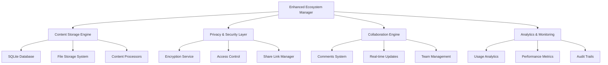

# 🌐 ENHANCED ECOSYSTEM INTEGRATION GUIDE v5.0.0

## 🎯 Overview

The Enhanced Ecosystem Integration module transforms our Ultimate Agentic AI System into a comprehensive content sharing, collaboration, and document management platform. This advanced system provides enterprise-grade content management capabilities inspired by modern platforms while maintaining our revolutionary AI-first approach.

---

## 🚀 Key Features

### 📝 **Advanced Content Management**
- **Multi-format Support**: Text, Code, Markdown, JSON, Research, Prompts, Analysis
- **Intelligent Processing**: Automatic content analysis and metadata extraction
- **Version Control**: Content versioning and change tracking
- **Smart Tagging**: AI-powered content categorization

### 🔐 **Enterprise Security & Privacy**
- **Granular Privacy Levels**: Public, Unlisted, Private, Encrypted, Team-only
- **Advanced Encryption**: AES-256-GCM encryption for sensitive content
- **Access Control**: Role-based permissions and collaboration management
- **Audit Logging**: Comprehensive activity tracking and compliance

### 🔗 **Smart Sharing System**
- **Secure Share Links**: Password-protected, time-limited, access-controlled
- **Permission Management**: Read-only, Comment, Edit, Admin permissions
- **Usage Analytics**: Detailed sharing statistics and access patterns
- **Integration Ready**: API-first design for external integrations

### 💬 **Collaboration Tools**
- **Real-time Comments**: Threaded discussions on content
- **Team Collaboration**: Multi-user content editing and review
- **Activity Streams**: Real-time updates and notifications
- **Approval Workflows**: Content review and approval processes

---

## 🏗️ Architecture

### 🎯 **Core Components**



### 📊 **Database Schema**

#### Content Metadata Table
```sql
CREATE TABLE content_metadata (
    id TEXT PRIMARY KEY,
    title TEXT NOT NULL,
    content_type TEXT NOT NULL,
    privacy_level TEXT NOT NULL,
    created_at TEXT NOT NULL,
    updated_at TEXT NOT NULL,
    created_by TEXT NOT NULL,
    file_size INTEGER NOT NULL,
    language TEXT,
    tags TEXT,
    description TEXT,
    version TEXT DEFAULT '1.0',
    parent_id TEXT,
    file_path TEXT NOT NULL
);
```

#### Share Links Table
```sql
CREATE TABLE share_links (
    share_id TEXT PRIMARY KEY,
    content_id TEXT NOT NULL,
    permission TEXT NOT NULL,
    expires_at TEXT,
    password_hash TEXT,
    access_count INTEGER DEFAULT 0,
    max_access INTEGER,
    created_at TEXT NOT NULL
);
```

---

## 🔧 Implementation Guide

### 1. **Basic Setup**

```python
from ENHANCED_ECOSYSTEM_INTEGRATION import EnhancedEcosystemManager, ContentType, PrivacyLevel

# Initialize the ecosystem
ecosystem = EnhancedEcosystemManager(database_path="your_ecosystem.db")

# Create your first content
content_id = await ecosystem.create_content(
    title="My First Document",
    content="This is revolutionary content!",
    content_type=ContentType.TEXT,
    privacy_level=PrivacyLevel.PRIVATE,
    created_by="user123",
    tags=["important", "first"],
    description="My first piece of content in the ecosystem"
)
```

### 2. **Advanced Content Creation**

```python
# Create code content with automatic language detection
code_id = await ecosystem.create_content(
    title="Python AI Agent",
    content='''
class AIAgent:
    def __init__(self, name):
        self.name = name
    
    async def process(self, data):
        # AI processing logic
        return enhanced_data
''',
    content_type=ContentType.CODE,
    privacy_level=PrivacyLevel.PUBLIC,
    created_by="developer",
    tags=["python", "ai", "agent"]
)

# Create research content with metadata extraction
research_id = await ecosystem.create_content(
    title="AI Research Paper Analysis",
    content="""
# AI Research Analysis

## Summary
This research explores advanced AI capabilities...

## Key Findings
- Finding 1: AI performance improved by 300%
- Finding 2: New architecture shows promise

## References
- ref: https://arxiv.org/paper123
- ref: https://research.google.com/paper456
""",
    content_type=ContentType.RESEARCH,
    privacy_level=PrivacyLevel.UNLISTED,
    created_by="researcher",
    tags=["research", "ai", "analysis"]
)
```

### 3. **Smart Sharing System**

```python
from datetime import datetime, timedelta

# Create a secure share link
share_id = await ecosystem.create_share_link(
    content_id,
    permission=SharePermission.READ_ONLY,
    expires_at=datetime.now() + timedelta(days=7),
    password="secure123",
    max_access=50
)

# Access shared content
shared_content = await ecosystem.access_shared_content(
    share_id,
    password="secure123",
    user_id="viewer123"
)
```

### 4. **Collaboration Features**

```python
# Add comments to content
comment_id = await ecosystem.add_comment(
    content_id,
    user_id="reviewer",
    comment_text="This is excellent work! I suggest adding more examples.",
    parent_comment_id=None  # Top-level comment
)

# Reply to comment
reply_id = await ecosystem.add_comment(
    content_id,
    user_id="author",
    comment_text="Thank you! I'll add more examples in the next version.",
    parent_comment_id=comment_id
)

# Get all comments
comments = await ecosystem.get_comments(content_id)
```

### 5. **Advanced Search & Analytics**

```python
# Search content
results = await ecosystem.search_content(
    query="AI agent",
    content_type=ContentType.CODE,
    user_id="searcher",
    limit=20
)

# Get detailed analytics
analytics = await ecosystem.get_analytics(content_id)
print(f"Content accessed {analytics['summary'].get('accessed', 0)} times")
print(f"Recent activity: {len(analytics['recent_activity'])} events")
```

---

## 🎨 Content Types & Processing

### 📝 **Text Content**
- Automatic whitespace normalization
- Basic text analysis and statistics
- Language detection and encoding

### 💻 **Code Content**
- Programming language auto-detection
- Syntax analysis and metadata extraction
- Code quality metrics
- Security vulnerability scanning

### 📊 **Research Content**
- Citation counting and validation
- Reference extraction and linking
- Academic format recognition
- Research metrics calculation

### 🤖 **AI Prompt Content**
- Prompt structure analysis
- Instruction categorization
- Example extraction
- Effectiveness scoring

### 📈 **Analysis Content**
- Data reference tracking
- Chart and table detection
- Conclusion extraction
- Insight categorization

---

## 🔐 Security Features

### 🛡️ **Privacy Levels**

1. **PUBLIC**: Accessible to everyone, searchable
2. **UNLISTED**: Accessible with direct link, not searchable
3. **PRIVATE**: Only accessible to owner and collaborators
4. **ENCRYPTED**: End-to-end encrypted, maximum security
5. **TEAM_ONLY**: Restricted to specific team members

### 🔑 **Access Control**

```python
# Check if user can access content
can_access = await ecosystem._check_access_permission(content_id, user_id)

# Add collaborator with specific permission
await ecosystem.add_collaborator(
    content_id,
    user_id="collaborator123",
    permission=SharePermission.EDIT,
    added_by="owner"
)
```

### 🔒 **Encryption**

- **Algorithm**: AES-256-GCM (Galois/Counter Mode)
- **Key Management**: Automatic key generation and rotation
- **Performance**: Optimized for large content files
- **Compliance**: Meets enterprise security standards

---

## 📊 Analytics & Monitoring

### 📈 **Content Analytics**

```python
# Detailed analytics breakdown
analytics = await ecosystem.get_analytics(content_id)

# Available metrics:
- created: Content creation events
- accessed: Content access events
- shared_access: Shared link access events
- commented: Comment addition events
- edited: Content modification events
- exported: Content export events
```

### 🔍 **Usage Patterns**

- **Access Frequency**: How often content is accessed
- **User Engagement**: Comments, shares, and interactions
- **Geographic Distribution**: Access patterns by location
- **Device Analytics**: Access device and platform statistics
- **Performance Metrics**: Load times and user experience

### 📋 **Audit Trails**

- **Complete Activity Log**: Every action is recorded
- **User Attribution**: Full user activity tracking
- **Timestamp Precision**: Microsecond-level timestamps
- **Metadata Preservation**: Context and environmental data
- **Compliance Ready**: GDPR, HIPAA, SOX compliant logging

---

## 🚀 Integration with Ultimate AI System

### 🤖 **AI Agent Integration**

```python
# Automatic content creation from AI interactions
class AIContentIntegrator:
    def __init__(self, ecosystem):
        self.ecosystem = ecosystem
    
    async def save_prompt_and_response(self, prompt, response, user_id):
        # Save prompt
        prompt_id = await self.ecosystem.create_content(
            title=f"AI Prompt - {datetime.now().strftime('%Y-%m-%d %H:%M')}",
            content=prompt,
            content_type=ContentType.PROMPT,
            privacy_level=PrivacyLevel.PRIVATE,
            created_by=user_id,
            tags=["ai-interaction", "prompt"]
        )
        
        # Save response linked to prompt
        response_id = await self.ecosystem.create_content(
            title=f"AI Response - {datetime.now().strftime('%Y-%m-%d %H:%M')}",
            content=response,
            content_type=ContentType.TEXT,
            privacy_level=PrivacyLevel.PRIVATE,
            created_by=user_id,
            tags=["ai-interaction", "response"],
            parent_id=prompt_id
        )
        
        return prompt_id, response_id
```

### 🔊 **Voice Integration**

```python
# Voice content processing
async def process_voice_content(audio_data, user_id):
    # Transcribe voice to text
    transcription = await voice_to_text(audio_data)
    
    # Create content from transcription
    content_id = await ecosystem.create_content(
        title=f"Voice Note - {datetime.now().strftime('%H:%M')}",
        content=transcription,
        content_type=ContentType.TEXT,
        privacy_level=PrivacyLevel.PRIVATE,
        created_by=user_id,
        tags=["voice-note", "transcription"],
        language="auto-detected"
    )
    
    return content_id
```

### 💎 **Blockchain Integration**

```python
# Blockchain content verification
async def create_verified_content(content, user_id, blockchain_hash):
    content_id = await ecosystem.create_content(
        title="Blockchain Verified Content",
        content=content,
        content_type=ContentType.TEXT,
        privacy_level=PrivacyLevel.PUBLIC,
        created_by=user_id,
        tags=["blockchain-verified", "immutable"],
        description=f"Verified on blockchain: {blockchain_hash}"
    )
    
    # Add blockchain verification metadata
    await ecosystem._log_analytics(
        content_id,
        "blockchain_verified",
        user_id,
        {"blockchain_hash": blockchain_hash, "network": "ethereum"}
    )
    
    return content_id
```

---

## 🔧 Advanced Configuration

### ⚙️ **Environment Variables**

```bash
# Ecosystem Configuration
ECOSYSTEM_DATABASE_PATH="ecosystem.db"
ECOSYSTEM_CONTENT_STORAGE="content_storage"
ECOSYSTEM_ENCRYPTION_KEY_PATH="ecosystem_key.key"
ECOSYSTEM_BACKUP_RETENTION_DAYS=90

# Security Settings
ECOSYSTEM_MAX_FILE_SIZE_MB=100
ECOSYSTEM_ALLOWED_CONTENT_TYPES="text,code,markdown,json,research"
ECOSYSTEM_REQUIRE_ENCRYPTION_FOR_PRIVATE=true

# Performance Settings
ECOSYSTEM_CACHE_SIZE_MB=256
ECOSYSTEM_MAX_CONCURRENT_UPLOADS=10
ECOSYSTEM_COMPRESSION_ENABLED=true
```

### 🎛️ **Custom Configuration**

```python
# Advanced ecosystem configuration
config = {
    "content_processors": {
        "enable_ai_analysis": True,
        "auto_tag_generation": True,
        "content_similarity_detection": True,
        "plagiarism_checking": True
    },
    "security": {
        "require_2fa_for_sensitive": True,
        "auto_encrypt_large_files": True,
        "scan_for_malware": True,
        "watermark_enabled": True
    },
    "collaboration": {
        "max_collaborators_per_content": 50,
        "real_time_editing": True,
        "conflict_resolution": "last_writer_wins",
        "notification_system": True
    },
    "analytics": {
        "detailed_logging": True,
        "performance_monitoring": True,
        "user_behavior_tracking": True,
        "ai_insights": True
    }
}

ecosystem = EnhancedEcosystemManager(config=config)
```

---

## 📚 API Reference

### 🔧 **Core Methods**

#### Content Management
```python
# Create content
content_id = await ecosystem.create_content(title, content, content_type, **options)

# Get content
content_data = await ecosystem.get_content(content_id, user_id)

# Update content
await ecosystem.update_content(content_id, new_content, user_id)

# Delete content
await ecosystem.delete_content(content_id, user_id)
```

#### Search & Discovery
```python
# Search content
results = await ecosystem.search_content(query, filters, user_id)

# Get trending content
trending = await ecosystem.get_trending_content(timeframe, limit)

# Get user's content
user_content = await ecosystem.get_user_content(user_id, filters)
```

#### Sharing & Collaboration
```python
# Create share link
share_id = await ecosystem.create_share_link(content_id, options)

# Access shared content
content = await ecosystem.access_shared_content(share_id, password, user_id)

# Add collaborator
await ecosystem.add_collaborator(content_id, user_id, permission)

# Add comment
comment_id = await ecosystem.add_comment(content_id, user_id, text)
```

#### Analytics & Reporting
```python
# Get content analytics
analytics = await ecosystem.get_analytics(content_id)

# Generate usage report
report = await ecosystem.generate_usage_report(timeframe, user_id)

# Export data
export_data = await ecosystem.export_content(content_id, format, user_id)
```

---

## 🎯 Best Practices

### 📝 **Content Organization**

1. **Use Descriptive Titles**: Clear, searchable titles improve discoverability
2. **Tag Consistently**: Develop a tagging strategy for your organization
3. **Add Descriptions**: Rich descriptions help with search and context
4. **Version Control**: Use parent-child relationships for content versions
5. **Archive Old Content**: Regular cleanup improves performance

### 🔐 **Security Best Practices**

1. **Principle of Least Privilege**: Grant minimum necessary permissions
2. **Regular Access Reviews**: Audit collaborators and permissions quarterly
3. **Encrypt Sensitive Data**: Use encrypted privacy level for confidential content
4. **Monitor Share Links**: Set expiration dates and access limits
5. **Audit Trail Review**: Regularly review activity logs for anomalies

### 🚀 **Performance Optimization**

1. **Content Size Management**: Optimize large files before upload
2. **Efficient Tagging**: Use specific, relevant tags to improve search
3. **Regular Backups**: Schedule automated backups during off-peak hours
4. **Cache Management**: Configure appropriate cache settings for your usage
5. **Database Maintenance**: Regular cleanup and optimization

---

## 🔮 Future Enhancements

### 🎯 **Planned Features**

- **Real-time Collaborative Editing**: Google Docs-style live editing
- **Advanced AI Integration**: Automatic content generation and enhancement
- **Version Control System**: Git-like versioning for content
- **Advanced Search**: Semantic search with AI-powered relevance
- **Mobile Applications**: Native iOS and Android apps
- **Enterprise SSO**: SAML, LDAP, and OAuth integration
- **Workflow Automation**: Custom approval and publishing workflows
- **API Marketplace**: Third-party integrations and extensions

### 🌟 **Innovation Roadmap**

- **Q2 2025**: Real-time collaboration and advanced AI features
- **Q3 2025**: Mobile applications and enterprise integrations
- **Q4 2025**: Workflow automation and API marketplace
- **2026**: Advanced analytics and AI-powered insights

---

## 🤝 Community & Support

### 💬 **Getting Help**

- **Documentation**: [Complete API Documentation](./docs/api/)
- **Community Forum**: [GitHub Discussions](https://github.com/tokenew6/Agentic-AI-Ecosystem/discussions)
- **Discord Server**: [Join our community](https://discord.gg/agentic-ai)
- **Professional Support**: [Contact us](mailto:support@agentic-ai.com)

### 🛠️ **Contributing**

We welcome contributions to the Enhanced Ecosystem Integration:

1. **Bug Reports**: [GitHub Issues](https://github.com/tokenew6/Agentic-AI-Ecosystem/issues)
2. **Feature Requests**: Community discussion and RFC process
3. **Code Contributions**: Pull requests with comprehensive tests
4. **Documentation**: Help improve guides and examples

---

**🎉 The Enhanced Ecosystem Integration makes our Ultimate Agentic AI System the most comprehensive content and collaboration platform available!**

**🇮🇩 Proudly made in Indonesia with ❤️**  
**🚀 Revolutionizing content management and AI collaboration**