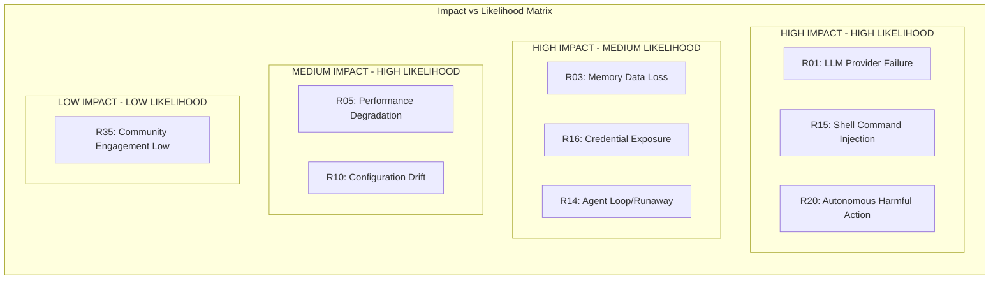
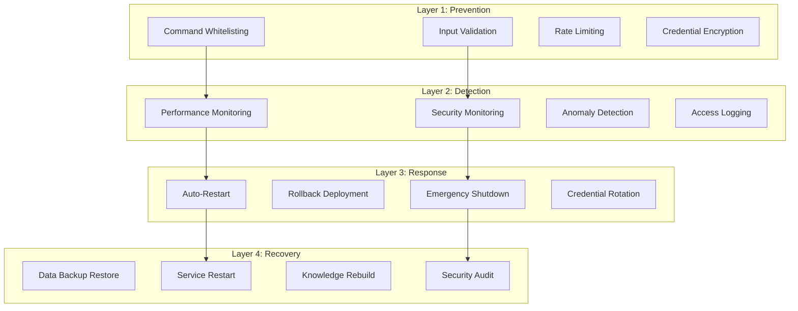

# Risk Register — AI-MultiColony-Ecosystem

> Comprehensive catalog of project risks with assessment, mitigation strategies, and contingency plans
> Version 2.0.0 | Cluster 2 — AI-MULTICOLONY-ECOSYSTEM

---

## Table of Contents

1. [Overview](#overview)
2. [Risk Assessment Framework](#risk-assessment-framework)
3. [Technical Risks](#technical-risks)
4. [Operational Risks](#operational-risks)
5. [Security Risks](#security-risks)
6. [Agent Safety Risks](#agent-safety-risks)
7. [Integration Risks](#integration-risks)
8. [Business Risks](#business-risks)
9. [Mitigation Strategies](#mitigation-strategies)
10. [Risk Monitoring Plan](#risk-monitoring-plan)

---

## Overview

This risk register catalogs all identified risks for the AI-MultiColony-Ecosystem project. Each risk is assessed using a standardized framework, with clear ownership, mitigation strategies, and contingency plans.

### Risk Summary

| Category | Total | Critical | High | Medium | Low |
|----------|-------|----------|------|--------|-----|
| Technical | 8 | 1 | 3 | 3 | 1 |
| Operational | 6 | 0 | 2 | 3 | 1 |
| Security | 7 | 2 | 3 | 2 | 0 |
| Agent Safety | 5 | 1 | 2 | 2 | 0 |
| Integration | 4 | 0 | 2 | 2 | 0 |
| Business | 5 | 0 | 1 | 3 | 1 |
| **Total** | **35** | **4** | **13** | **15** | **3** |

### Risk Heat Map

---

## Risk Assessment Framework

### Scoring Criteria

**Likelihood** (1-5):

| Score | Description | Frequency |
|-------|-------------|-----------|
| 1 | Very Unlikely | < 5% chance |
| 2 | Unlikely | 5-20% chance |
| 3 | Possible | 20-50% chance |
| 4 | Likely | 50-80% chance |
| 5 | Almost Certain | > 80% chance |

**Impact** (1-5):

| Score | Description | Effect |
|-------|-------------|--------|
| 1 | Negligible | Minor inconvenience |
| 2 | Minor | Small delay or cost increase |
| 3 | Moderate | Significant delay or feature loss |
| 4 | Major | Project milestone missed |
| 5 | Critical | Project failure or security breach |

**Risk Score = Likelihood × Impact**

| Risk Score | Level | Action Required |
|------------|-------|----------------|
| 1-4 | Low | Monitor only |
| 5-9 | Medium | Mitigation plan needed |
| 10-15 | High | Active mitigation required |
| 16-25 | Critical | Immediate action required |

---

## Technical Risks

### R01: LLM Provider Failure or Deprecation

| Attribute | Value |
|-----------|-------|
| **ID** | R01 |
| **Category** | Technical |
| **Likelihood** | 4 (Likely) |
| **Impact** | 5 (Critical) |
| **Risk Score** | 20 (Critical) |
| **Owner** | LLM Provider Manager |
| **Status** | Active |

**Description**: Primary LLM provider (LLM7) could experience outages, change API terms, or deprecate free tier access. This would disrupt all agent intelligence capabilities.

**Impact**: Complete system failure — agents cannot generate responses without LLM access.

**Mitigation**:
- Multi-provider failover system (LLM7 → OpenRouter → Camel → OpenAI)
- Response caching for common queries
- Graceful degradation with cached responses
- Monitor provider health with automated alerts

**Contingency**: Switch primary provider within 5 minutes via configuration change. Pre-built adapters for 4+ providers.

---

### R02: Framework Incompatibility

| Attribute | Value |
|-----------|-------|
| **ID** | R02 |
| **Category** | Technical |
| **Likelihood** | 3 (Possible) |
| **Impact** | 3 (Moderate) |
| **Risk Score** | 9 (Medium) |
| **Owner** | Integration Team |
| **Status** | Active |

**Description**: LangGraph, CrewAI, or AutoGen could release breaking changes that break our adapter layer.

**Impact**: One or more framework integrations stop working until adapters are updated.

**Mitigation**:
- Pin dependency versions in `requirements.txt`
- Optional imports with `try/except` (already implemented)
- Comprehensive integration tests
- Monitor framework changelogs

**Contingency**: Disable affected adapter and fall back to direct agent execution.

---

### R03: Memory Data Loss

| Attribute | Value |
|-----------|-------|
| **ID** | R03 |
| **Category** | Technical |
| **Likelihood** | 2 (Unlikely) |
| **Impact** | 5 (Critical) |
| **Risk Score** | 10 (High) |
| **Owner** | Memory Bus Team |
| **Status** | Active |

**Description**: SQLite database corruption or accidental deletion could result in loss of all agent memories, knowledge base, and task history.

**Impact**: Agents lose all context, must relearn from scratch. Knowledge base must be rebuilt.

**Mitigation**:
- Automated daily backups via AgentScheduler (`auto_backup` task)
- 30-day retention policy for backups
- Compressed backup storage
- Redis cache provides additional resilience

**Contingency**: Restore from most recent backup. Use ExternalKnowledgeAPI to rebuild knowledge base.

---

### R04: Performance Degradation Under Load

| Attribute | Value |
|-----------|-------|
| **ID** | R04 |
| **Category** | Technical |
| **Likelihood** | 3 (Possible) |
| **Impact** | 3 (Moderate) |
| **Risk Score** | 9 (Medium) |
| **Owner** | System Optimizer |
| **Status** | Active |

**Description**: System may slow down or fail when handling many concurrent workflows, especially with LLM API rate limits.

**Impact**: Increased response times, timeout errors, failed workflows.

**Mitigation**:
- Agent 02 performance monitoring with bottleneck detection
- Load balancing via AISelector
- LLM rate limiting awareness
- SQLite to PostgreSQL migration path for scaling
- Redis caching for frequently accessed data

**Contingency**: Implement request queuing and priority-based scheduling.

---

### R05: Async/Threading Issues

| Attribute | Value |
|-----------|-------|
| **ID** | R05 |
| **Category** | Technical |
| **Likelihood** | 3 (Possible) |
| **Impact** | 2 (Minor) |
| **Risk Score** | 6 (Medium) |
| **Owner** | Core Team |
| **Status** | Active |

**Description**: The system uses both threading (scheduler, monitoring) and asyncio (LLM calls, workflows). Improper mixing could cause deadlocks or race conditions.

**Impact**: Intermittent failures, deadlocks, or data corruption.

**Mitigation**:
- Thread-safe operations via `threading.Lock` in MemoryBus
- `_run_task_async()` method handles sync/async bridge safely
- Careful separation of threaded and async code paths

**Contingency**: Restart affected services. Lock-protected state prevents corruption.

---

### R06: Dependency Vulnerabilities

| Attribute | Value |
|-----------|-------|
| **ID** | R06 |
| **Category** | Technical |
| **Likelihood** | 3 (Possible) |
| **Impact** | 4 (Major) |
| **Risk Score** | 12 (High) |
| **Owner** | Security Team |
| **Status** | Active |

**Description**: Python packages in `requirements.txt` may contain security vulnerabilities.

**Impact**: Potential exploit vector for attackers.

**Mitigation**:
- Regular `pip audit` scans
- Pin specific package versions
- Minimal dependency policy
- Security review of all direct dependencies

**Contingency**: Patch or replace vulnerable packages immediately.

---

### R07: Python GIL Limitations

| Attribute | Value |
|-----------|-------|
| **ID** | R07 |
| **Category** | Technical |
| **Likelihood** | 4 (Likely) |
| **Impact** | 2 (Minor) |
| **Risk Score** | 8 (Medium) |
| **Owner** | Core Team |
| **Status** | Accepted |

**Description**: Python's Global Interpreter Lock (GIL) limits true parallelism for CPU-bound operations.

**Impact**: Some operations may not fully utilize multi-core processors.

**Mitigation**:
- Use multiprocessing for CPU-intensive tasks
- Asyncio for I/O-bound operations
- Consider Rust (openfang) for performance-critical paths

**Contingency**: Accept as current limitation; plan migration paths for critical paths.

---

### R08: Schema Migration Complexity

| Attribute | Value |
|-----------|-------|
| **ID** | R08 |
| **Category** | Technical |
| **Likelihood** | 2 (Unlikely) |
| **Impact** | 3 (Moderate) |
| **Risk Score** | 6 (Medium) |
| **Owner** | Database Team |
| **Status** | Active |

**Description**: As the system evolves, database schema changes may be needed that could break existing data.

**Impact**: Data migration failures, feature delays.

**Mitigation**:
- `database/migrations.py` for structured schema changes
- Backward-compatible schema changes
- Test migrations on backup data first

**Contingency**: Roll back to previous schema version.

---

## Operational Risks

### R09: Deployment Failures

| Attribute | Value |
|-----------|-------|
| **ID** | R09 |
| **Category** | Operational |
| **Likelihood** | 3 (Possible) |
| **Impact** | 4 (Major) |
| **Risk Score** | 12 (High) |
| **Owner** | Deploy Manager |
| **Status** | Active |

**Description**: Multi-platform deployment introduces risk of platform-specific failures, configuration mismatches, or API key issues.

**Impact**: Service downtime, broken deployments.

**Mitigation**:
- Automated rollback via Deploy Manager
- Health checks after deployment
- Staged rollout (staging → production)
- Configuration validation before deploy

**Contingency**: One-command rollback to previous deployment.

---

### R10: Configuration Drift

| Attribute | Value |
|-----------|-------|
| **ID** | R10 |
| **Category** | Operational |
| **Likelihood** | 4 (Likely) |
| **Impact** | 3 (Moderate) |
| **Risk Score** | 12 (High) |
| **Owner** | DevOps |
| **Status** | Active |

**Description**: Different environments (dev, staging, prod) may have inconsistent configurations.

**Impact**: Bugs that only appear in production, unexpected behavior.

**Mitigation**:
- Centralized `system_config.yaml`
- Environment variable overrides with clear mapping
- Configuration validation on startup
- `.env.example` for consistent setup

**Contingency**: Reset environment to known good state from config.

---

### R11: Monitoring Blind Spots

| Attribute | Value |
|-----------|-------|
| **ID** | R11 |
| **Category** | Operational |
| **Likelihood** | 3 (Possible) |
| **Impact** | 3 (Moderate) |
| **Risk Score** | 9 (Medium) |
| **Owner** | Commander AGI |
| **Status** | Active |

**Description**: System may have monitoring gaps where failures go undetected.

**Impact**: Extended downtime, data loss, security breaches.

**Mitigation**:
- Agent 02 performance monitoring (5-minute intervals)
- Commander AGI security monitoring (5-second intervals)
- AgentScheduler health checks (5-minute intervals)
- Alert thresholds for CPU, memory, disk, response time

**Contingency**: Manual system check procedures.

---

### R12: Resource Exhaustion

| Attribute | Value |
|-----------|-------|
| **ID** | R12 |
| **Category** | Operational |
| **Likelihood** | 2 (Unlikely) |
| **Impact** | 4 (Major) |
| **Risk Score** | 8 (Medium) |
| **Owner** | System Optimizer |
| **Status** | Active |

**Description**: System could run out of memory, disk space, or API rate limits.

**Impact**: Service degradation or failure.

**Mitigation**:
- Memory cleanup via AgentScheduler (daily at 2 AM)
- Redis TTL for cache entries
- SQLite size monitoring
- LLM rate limit tracking

**Contingency**: Emergency resource cleanup and service restart.

---

## Security Risks

### R13: Shell Command Injection

| Attribute | Value |
|-----------|-------|
| **ID** | R13 |
| **Category** | Security |
| **Likelihood** | 3 (Possible) |
| **Impact** | 5 (Critical) |
| **Risk Score** | 15 (High) |
| **Owner** | Security Team |
| **Status** | Active |

**Description**: Despite whitelisting, a crafted prompt could trick an agent into executing dangerous shell commands through the CyberShell agent.

**Impact**: System compromise, data destruction, unauthorized access.

**Mitigation**:
- Command whitelisting (`allowed_commands` list)
- Pattern blocking (`blocked_patterns` for rm -rf, fork bombs, etc.)
- Dangerous flag detection (-rf, --force with rm)
- Sensitive file access prevention (/etc/passwd, id_rsa)
- Security validation before every command execution

**Contingency**: Immediate agent termination and security audit.

---

### R14: Credential Exposure

| Attribute | Value |
|-----------|-------|
| **ID** | R14 |
| **Category** | Security |
| **Likelihood** | 2 (Unlikely) |
| **Impact** | 5 (Critical) |
| **Risk Score** | 10 (High) |
| **Owner** | Credential Manager |
| **Status** | Active |

**Description**: API keys, tokens, and credentials could be exposed in logs, memory entries, or configuration files.

**Impact**: Unauthorized access to LLM providers, cloud platforms, and databases.

**Mitigation**:
- Credential Manager for secure storage
- Environment variable injection (not hardcoded)
- `.env.example` with placeholder values
- Log sanitization to strip sensitive data
- AES-256 encryption for stored credentials

**Contingency**: Rotate all exposed credentials immediately.

---

### R15: Prompt Injection

| Attribute | Value |
|-----------|-------|
| **ID** | R15 |
| **Category** | Security |
| **Likelihood** | 4 (Likely) |
| **Impact** | 4 (Major) |
| **Risk Score** | 16 (Critical) |
| **Owner** | Security Team |
| **Status** | Active |

**Description**: Malicious user input could manipulate agent behavior through prompt injection attacks.

**Impact**: Agents executing unintended actions, data exfiltration, system compromise.

**Mitigation**:
- Input validation via `BaseAgent.validate_input()`
- Input sanitization in security configuration
- 10MB max input size limit
- System prompts that define strict boundaries
- Output monitoring for anomalous behavior

**Contingency**: Rate limit and block offending user, audit affected operations.

---

### R16: Unauthorized API Access

| Attribute | Value |
|-----------|-------|
| **ID** | R16 |
| **Category** | Security |
| **Likelihood** | 2 (Unlikely) |
| **Impact** | 4 (Major) |
| **Risk Score** | 8 (Medium) |
| **Owner** | Auth Team |
| **Status** | Active |

**Description**: Unauthorized users could access API endpoints or agent capabilities.

**Impact**: Unauthorized use of LLM credits, data access, system manipulation.

**Mitigation**:
- JWT authentication (configurable, currently disabled for dev)
- CORS protection
- Rate limiting (100 req/min, burst limit 20)
- API security configuration in `system_config.yaml`

**Contingency**: Enable authentication and block unauthorized access.

---

## Agent Safety Risks

### R17: Autonomous Harmful Actions

| Attribute | Value |
|-----------|-------|
| **ID** | R17 |
| **Category** | Agent Safety |
| **Likelihood** | 2 (Unlikely) |
| **Impact** | 5 (Critical) |
| **Risk Score** | 10 (High) |
| **Owner** | Safety Team |
| **Status** | Active |

**Description**: Agents operating autonomously could take harmful actions — deleting files, sending unauthorized messages, making financial commitments.

**Impact**: Data loss, financial loss, reputation damage.

**Mitigation**:
- Command whitelisting in CyberShell
- Human confirmation for destructive operations
- Deployment dry-run mode (`auto_deploy: false`)
- Commander AGI security monitoring
- Activity logging for all agent actions

**Contingency**: Emergency shutdown procedure, audit trail for forensics.

---

### R18: Agent Runaway/Infinite Loops

| Attribute | Value |
|-----------|-------|
| **ID** | R18 |
| **Category** | Agent Safety |
| **Likelihood** | 3 (Possible) |
| **Impact** | 3 (Moderate) |
| **Risk Score** | 9 (Medium) |
| **Owner** | Agent Manager |
| **Status** | Active |

**Description**: An agent could enter an infinite loop, consuming resources indefinitely.

**Impact**: Resource exhaustion, degraded system performance.

**Mitigation**:
- Task timeout (300 seconds default)
- Max consecutive auto-reply limit in AutoGen (3)
- Process timeout in CyberShell (300 seconds)
- AgentScheduler retry limits (3 max retries)
- Exponential backoff on retry

**Contingency**: Force-kill the process via CyberShell process management.

---

### R19: Cross-Agent Data Leakage

| Attribute | Value |
|-----------|-------|
| **ID** | R19 |
| **Category** | Agent Safety |
| **Likelihood** | 2 (Unlikely) |
| **Impact** | 3 (Moderate) |
| **Risk Score** | 6 (Medium) |
| **Owner** | Memory Team |
| **Status** | Active |

**Description**: Agent A's sensitive data could be accessed by Agent B through shared memory.

**Impact**: Information disclosure, privacy violations.

**Mitigation**:
- Agent-specific memory retrieval (`agent_id` filtering)
- Access control in memory queries
- Memory type isolation (interaction vs. knowledge vs. result)

**Contingency**: Audit memory access logs and restrict agent permissions.

---

### R20: Self-Modification Risks

| Attribute | Value |
|-----------|-------|
| **ID** | R20 |
| **Category** | Agent Safety |
| **Likelihood** | 2 (Unlikely) |
| **Impact** | 4 (Major) |
| **Risk Score** | 8 (Medium) |
| **Owner** | Meta Agent Creator |
| **Status** | Active |

**Description**: The Meta Agent Creator can generate new agents and modify code. Self-modification could introduce bugs or security vulnerabilities.

**Impact**: Unpredictable agent behavior, security vulnerabilities.

**Mitigation**:
- Generated agents follow template patterns
- Code review before deployment
- Sandboxed testing environment
- Version control for generated agents

**Contingency**: Roll back generated agent to previous version.

---

## Integration Risks

### R21: 21-Repo Merge Conflicts

| Attribute | Value |
|-----------|-------|
| **ID** | R21 |
| **Category** | Integration |
| **Likelihood** | 3 (Possible) |
| **Impact** | 3 (Moderate) |
| **Risk Score** | 9 (Medium) |
| **Owner** | Integration Team |
| **Status** | Active |

**Description**: Merging 21 repositories could result in code conflicts, duplicated functionality, or inconsistent patterns.

**Impact**: Code quality degradation, maintenance burden.

**Mitigation**:
- Adapter pattern for framework integration
- Optional imports with try/except
- Clear module boundaries
- Per-repo integration testing

**Contingency**: Defer problematic integration and use adapter pattern.

---

### R22: Framework Version Conflicts

| Attribute | Value |
|-----------|-------|
| **ID** | R22 |
| **Category** | Integration |
| **Likelihood** | 3 (Possible) |
| **Impact** | 3 (Moderate) |
| **Risk Score** | 9 (Medium) |
| **Owner** | Integration Team |
| **Status** | Active |

**Description**: LangGraph, CrewAI, and AutoGen may require different versions of shared dependencies.

**Impact**: Import errors, runtime failures.

**Mitigation**:
- Optional framework imports
- Independent adapter modules
- Version pinning in requirements.txt

**Contingency**: Isolate framework dependencies using virtual environments.

---

## Business Risks

### R23: LLM Cost Overruns

| Attribute | Value |
|-----------|-------|
| **ID** | R23 |
| **Category** | Business |
| **Likelihood** | 3 (Possible) |
| **Impact** | 3 (Moderate) |
| **Risk Score** | 9 (Medium) |
| **Owner** | Business Team |
| **Status** | Active |

**Description**: Heavy LLM usage could result in significant API costs, especially if failover switches to paid providers.

**Impact**: Unexpected expenses, service limitations.

**Mitigation**:
- LLM7 free tier as primary provider
- Usage tracking per provider (`LLMClient.get_provider_stats()`)
- Rate limiting per provider
- Response caching to reduce redundant calls

**Contingency**: Enforce stricter rate limits and switch to free-tier providers.

---

### R24: Community Adoption Risk

| Attribute | Value |
|-----------|-------|
| **ID** | R24 |
| **Category** | Business |
| **Likelihood** | 2 (Unlikely) |
| **Impact** | 3 (Moderate) |
| **Risk Score** | 6 (Medium) |
| **Owner** | Marketing Agent |
| **Status** | Active |

**Description**: The project may not gain sufficient community adoption to sustain development.

**Impact**: Reduced contributions, slower development.

**Mitigation**:
- Marketing Agent for automated promotion
- Open source MIT license
- Comprehensive documentation
- Active GitHub presence

**Contingency**: Focus on enterprise adoption path.

---

## Mitigation Strategies

### Strategic Mitigations

| Risk Level | Strategy | Examples |
|-----------|----------|---------|
| **Critical** | Prevent + Detect + Respond | Multi-provider failover, security whitelisting, emergency shutdown |
| **High** | Prevent + Detect | Daily backups, health monitoring, input validation |
| **Medium** | Detect + Respond | Performance monitoring, logging, configuration management |
| **Low** | Monitor | Watch for changes, periodic review |

### Defense in Depth

---

## Risk Monitoring Plan

### Automated Monitoring

| Monitor | Tool | Frequency | Alert Condition |
|---------|------|-----------|-----------------|
| Agent health | Agent 02 | Every 5 minutes | Agent status != active |
| System resources | Commander AGI | Every 5 seconds | CPU > 90%, RAM > 80% |
| LLM provider health | LLM Client | Per request | Provider failure |
| Memory usage | Memory Bus | Per operation | DB size > threshold |
| Security events | Commander AGI | Every 5 seconds | Threat detected |
| Deployment health | Deploy Manager | Post-deploy | Health check failed |
| Scheduled tasks | AgentScheduler | Per execution | 3+ failures |

### Review Schedule

| Review Type | Frequency | Participants |
|-------------|-----------|-------------|
| Risk register update | Weekly | Core team |
| Security review | Monthly | Security team |
| Performance review | Bi-weekly | System optimizer |
| Integration health | Monthly | Integration team |
| Full risk assessment | Quarterly | All stakeholders |

### Escalation Matrix

| Risk Level | Response Time | Escalation Path |
|-----------|--------------|----------------|
| Critical | Immediate | Security team → Project lead |
| High | < 1 hour | Team lead → Project lead |
| Medium | < 24 hours | Assigned owner |
| Low | Next review cycle | Monitor only |

---

*This risk register is maintained as part of the AI-MultiColony-Ecosystem project. Last updated: 2025-07-13.*
