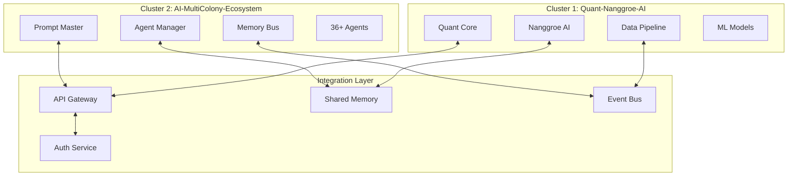
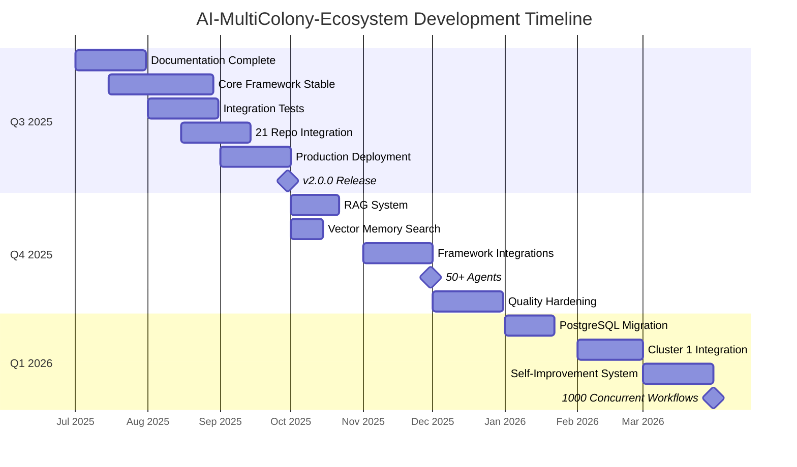

# Development Roadmap — AI-MultiColony-Ecosystem

> Strategic development plan for the Autonomous Agent Operating System
> Version 2.0.0 | Cluster 2 — AI-MULTICOLONY-ECOSYSTEM

---

## Table of Contents

1. [Vision](#vision)
2. [Q3 2025: Core Framework](#q3-2025-core-framework)
3. [Q4 2025: Advanced Features](#q4-2025-advanced-features)
4. [Q1 2026: Scale and Optimize](#q1-2026-scale-and-optimize)
5. [Integration with Cluster 1](#integration-with-cluster-1-quant-nanggroe-ai)
6. [Success Metrics](#success-metrics)
7. [Milestone Tracker](#milestone-tracker)

---

## Vision

**Build the world's first Autonomous Agent Operating System** — a colony-based multi-agent platform where specialized AI agents collaborate to accomplish complex tasks, from software development to business operations, with human-like memory and self-improvement capabilities.

### Long-Term Goals (2025-2027)

| Goal | Target Date | Description |
|------|------------|-------------|
| Production-ready core | Q3 2025 | Stable, tested, documented core framework |
| 50+ specialized agents | Q4 2025 | Full agent ecosystem covering all domains |
| Cross-colony integration | Q1 2026 | Seamless integration with Cluster 1 (Quant-Nanggroe-AI) |
| Self-improving system | Q2 2026 | Agents that autonomously improve their own code |
| AGI-like reasoning | Q4 2026 | Advanced reasoning across all agents |
| Global deployment | Q1 2027 | Production at scale with 99.9% uptime |

---

## Q3 2025: Core Framework

**Theme**: Build, stabilize, and document the core system

### July 2025 — Foundation Hardening

| Week | Task | Priority | Status |
|------|------|----------|--------|
| W1 | Complete 8 documentation files | High | ✅ In Progress |
| W1 | Architecture review and validation | High | Planned |
| W2 | Base agent interface finalization | High | Planned |
| W2 | Agent lifecycle management | High | Planned |
| W3 | Memory system stabilization | Medium | Planned |
| W3 | Security audit (CyberShell, Commander AGI) | High | Planned |
| W4 | Integration test suite | High | Planned |
| W4 | CI/CD pipeline setup | Medium | Planned |

### August 2025 — Integration Completion

| Week | Task | Priority | Status |
|------|------|----------|--------|
| W1 | LangGraph integration testing | High | Planned |
| W1 | CrewAI integration testing | High | Planned |
| W2 | AutoGen integration testing | High | Planned |
| W2 | Multi-provider LLM failover testing | High | Planned |
| W3 | All 21 repo integrations validated | High | Planned |
| W3 | Tool registry complete (48 tools) | Medium | Planned |
| W4 | Skill registry complete (30 skills) | Medium | Planned |
| W4 | Performance benchmarking | Medium | Planned |

### September 2025 — Production Readiness

| Week | Task | Priority | Status |
|------|------|----------|--------|
| W1 | Docker production configuration | High | Planned |
| W1 | Kubernetes deployment validation | High | Planned |
| W2 | Load testing (100 concurrent workflows) | High | Planned |
| W2 | Security penetration testing | High | Planned |
| W3 | Web interface PWA validation | Medium | Planned |
| W3 | Voice interface testing | Medium | Planned |
| W4 | Documentation review | Medium | Planned |
| W4 | Release v2.0.0 | High | Planned |

### Q3 2025 Deliverables

| Deliverable | Target | Success Criteria |
|-------------|--------|-----------------|
| Core framework | July | All 36+ agents operational |
| Documentation | July | 8 comprehensive docs (400+ lines each) |
| Integration tests | August | > 80% code coverage |
| 21 repo integration | August | All repos merged and validated |
| Production deployment | September | Docker + K8s deployment working |
| v2.0.0 release | September | Stable, documented, tested |

---

## Q4 2025: Advanced Features

**Theme**: Expand capabilities, add intelligence, improve quality

### October 2025 — Advanced Agent Capabilities

| Task | Priority | Estimated Effort |
|------|----------|-----------------|
| Vector embedding for memory search | High | 2 weeks |
| RAG (Retrieval-Augmented Generation) system | High | 3 weeks |
| Multi-modal agent support (image, video) | Medium | 3 weeks |
| Advanced prompt engineering with DSPy | Medium | 2 weeks |
| Agent learning from feedback | High | 2 weeks |
| Dynamic agent spawning in production | Medium | 1 week |

### November 2025 — Extended Framework Support

| Task | Priority | Estimated Effort |
|------|----------|-----------------|
| PydanticAI integration | Medium | 1 week |
| Semantic Kernel integration | Medium | 2 weeks |
| Haystack integration for RAG | High | 2 weeks |
| LlamaIndex integration | Medium | 2 weeks |
| SmolAgents lightweight mode | Low | 1 week |
| MetaGPT software development crew | Medium | 2 weeks |

### December 2025 — Quality and Reliability

| Task | Priority | Estimated Effort |
|------|----------|-----------------|
| Comprehensive error recovery | High | 2 weeks |
| Agent health monitoring dashboard | High | 2 weeks |
| Automated performance optimization | Medium | 3 weeks |
| Security hardening (Docker sandbox) | High | 2 weeks |
| Rate limiting and throttling | Medium | 1 week |
| Multi-tenant support | Medium | 3 weeks |

### Q4 2025 Deliverables

| Deliverable | Target | Success Criteria |
|-------------|--------|-----------------|
| RAG system | October | Semantic search over knowledge base |
| 10+ framework integrations | November | All 25+ benchmarks integrated or planned |
| 50+ specialized agents | November | Full ecosystem coverage |
| 99% uptime | December | Production monitoring confirmed |
| Docker sandbox mode | December | All shell commands in containers |

---

## Q1 2026: Scale and Optimize

**Theme**: Scale the system, optimize performance, integrate across clusters

### January 2026 — Performance Optimization

| Task | Priority | Estimated Effort |
|------|----------|-----------------|
| PostgreSQL migration path | High | 3 weeks |
| Redis cluster for memory | High | 2 weeks |
| Agent pooling and reuse | Medium | 2 weeks |
| Workflow caching | Medium | 1 week |
| Async pipeline optimization | High | 2 weeks |
| Memory compression | Low | 1 week |

### February 2026 — Cross-Colony Integration

| Task | Priority | Estimated Effort |
|------|----------|-----------------|
| Cluster 1 API integration | High | 3 weeks |
| Shared memory across clusters | High | 2 weeks |
| Cross-colony agent communication | High | 2 weeks |
| Unified deployment pipeline | Medium | 2 weeks |
| Cluster health monitoring | Medium | 1 week |

### March 2026 — Self-Improvement

| Task | Priority | Estimated Effort |
|------|----------|-----------------|
| Meta-learning system | High | 4 weeks |
| Auto-code improvement | Medium | 3 weeks |
| Skill quality auto-evaluation | Medium | 2 weeks |
| Agent capability auto-extension | Medium | 3 weeks |
| Performance self-tuning | Low | 2 weeks |

### Q1 2026 Deliverables

| Deliverable | Target | Success Criteria |
|-------------|--------|-----------------|
| PostgreSQL support | January | Migration from SQLite seamless |
| Cluster 1 integration | February | Bidirectional communication working |
| Self-improvement loop | March | Agents improve own code |
| 1000+ concurrent workflows | March | Load test at scale |

---

## Integration with Cluster 1 (Quant-Nanggroe-AI)

### Integration Architecture

### Integration Phases

| Phase | Timeline | Description |
|-------|----------|-------------|
| **Phase 1** | Q4 2025 | API-level integration — agents can call Cluster 1 services |
| **Phase 2** | Q1 2026 | Shared memory — clusters share knowledge base |
| **Phase 3** | Q1 2026 | Event-driven — clusters react to each other's events |
| **Phase 4** | Q2 2026 | Agent migration — agents can work across clusters |
| **Phase 5** | Q3 2026 | Unified colony — both clusters as one organism |

### Shared Capabilities

| Cluster 2 Provides | Cluster 1 Provides |
|-------------------|-------------------|
| Multi-agent orchestration | Quantitative analysis |
| Code generation & deployment | ML model training |
| Security monitoring | Data processing pipelines |
| Marketing automation | Financial modeling |
| Web interface & PWA | AI model serving |

---

## Success Metrics

### Technical Metrics

| Metric | Q3 2025 Target | Q4 2025 Target | Q1 2026 Target |
|--------|---------------|---------------|---------------|
| Agent count | 36+ | 50+ | 75+ |
| Skill count | 30 | 50 | 80 |
| Tool count | 48 | 60 | 80 |
| Test coverage | 80% | 90% | 95% |
| Uptime | 95% | 99% | 99.9% |
| Avg response time | < 5s | < 3s | < 2s |
| Concurrent workflows | 10 | 100 | 1000 |
| Memory entries | 10K | 100K | 1M |
| LLM providers | 4 | 6 | 8 |

### Quality Metrics

| Metric | Q3 2025 Target | Q4 2025 Target | Q1 2026 Target |
|--------|---------------|---------------|---------------|
| Agent success rate | > 85% | > 90% | > 95% |
| Skill reliability | > 80% | > 90% | > 95% |
| Error recovery rate | > 70% | > 85% | > 95% |
| User satisfaction | 3.5/5 | 4.0/5 | 4.5/5 |
| Documentation coverage | 100% | 100% | 100% |

### Business Metrics

| Metric | Q3 2025 Target | Q4 2025 Target | Q1 2026 Target |
|--------|---------------|---------------|---------------|
| Active users | 10 | 100 | 1000 |
| GitHub stars | 100 | 500 | 2000 |
| Community contributors | 5 | 20 | 50 |
| Integrations deployed | 5 | 25 | 100 |
| Monthly API calls | 1K | 10K | 100K |

---

## Milestone Tracker

### Key Milestones

| Milestone | Date | Significance |
|-----------|------|-------------|
| v2.0.0 Release | 2025-09-30 | First stable release |
| RAG System Live | 2025-10-21 | Semantic search operational |
| 50 Agents | 2025-11-30 | Full ecosystem coverage |
| Cluster 1 Integration | 2026-02-28 | Cross-colony communication |
| Self-Improvement | 2026-03-31 | Agents improve autonomously |

---

## Risk Adjustments

The roadmap accounts for potential risks:

| Risk | Impact on Roadmap | Mitigation |
|------|------------------|------------|
| LLM provider changes | Delay in Q3 | Multi-provider failover |
| Security vulnerabilities | Pause for Q4 hardening | Continuous security audits |
| Performance bottlenecks | Scale timeline adjusted | Load testing every sprint |
| Team capacity | Prioritize core features | Community contributions |
| Technology shifts | Adapt framework integrations | Modular adapter pattern |

---

## Q2 2026+: Long-Term Vision

**Theme**: Achieve autonomous self-improvement and AGI-like capabilities

### Q2 2026 — Autonomous Evolution

| Task | Priority | Estimated Effort |
|------|----------|-----------------|
| Self-modifying agent code | High | 4 weeks |
| Automatic skill creation from experience | High | 3 weeks |
| Cross-domain knowledge transfer | Medium | 3 weeks |
| Agent personality development | Low | 2 weeks |
| Emergent behavior monitoring | High | 2 weeks |
| Autonomous bug fixing pipeline | Medium | 3 weeks |

### Q3 2026 — Unified Colony

| Task | Priority | Estimated Effort |
|------|----------|-----------------|
| Full Cluster 1 + 2 merge | High | 6 weeks |
| Shared agent ecosystem | High | 4 weeks |
| Unified memory architecture | High | 3 weeks |
| Cross-cluster workflow orchestration | Medium | 4 weeks |
| Single deployment pipeline | Medium | 2 weeks |

### Q4 2026 — AGI-Like Reasoning

| Task | Priority | Estimated Effort |
|------|----------|-----------------|
| Chain-of-thought reasoning engine | High | 6 weeks |
| Multi-step planning with backtracking | High | 4 weeks |
| Causal reasoning framework | Medium | 4 weeks |
| Abstract concept understanding | Medium | 5 weeks |
| Self-awareness metrics | Low | 2 weeks |

### Q1 2027 — Global Scale

| Task | Priority | Estimated Effort |
|------|----------|-----------------|
| Multi-region deployment | High | 4 weeks |
| 99.9% uptime SLA | High | 3 weeks |
| Horizontal auto-scaling | High | 3 weeks |
| Enterprise security compliance | High | 4 weeks |
| Global CDN optimization | Medium | 2 weeks |

---

## Technology Evolution Roadmap

### Current Stack (Q3 2025)

| Component | Technology | Version |
|-----------|-----------|---------|
| Language | Python | 3.11+ |
| Web Framework | Flask | Latest |
| Database | SQLite + Redis | Latest |
| LLM | LLM7, OpenRouter, Camel, OpenAI | API v1 |
| Orchestration | LangGraph, CrewAI, AutoGen | Latest |
| Deployment | Docker, K8s | Latest |

### Planned Evolution

| Quarter | Change | Reason |
|---------|--------|--------|
| Q4 2025 | Add PostgreSQL support | Production scalability |
| Q4 2025 | Add vector database (ChromaDB/Qdrant) | Semantic memory search |
| Q1 2026 | Add FastAPI alongside Flask | High-throughput API endpoints |
| Q1 2026 | Redis Cluster | Memory scaling |
| Q2 2026 | gRPC for inter-agent communication | Lower latency |
| Q3 2026 | Rust microservices (via openfang) | Performance-critical paths |
| Q4 2026 | WebAssembly agents | Edge deployment |

---

## Resource Requirements

### Q3 2025 — Minimum Viable

| Resource | Specification | Cost |
|----------|-------------|------|
| Development Server | 4 vCPU, 8GB RAM | $20/mo |
| LLM API (Free Tier) | LLM7 free tier | $0/mo |
| Domain + SSL | Standard domain | $15/yr |
| CI/CD (GitHub Actions) | Free tier | $0/mo |
| **Total** | | **~$22/mo** |

### Q4 2025 — Production

| Resource | Specification | Cost |
|----------|-------------|------|
| Production Server | 8 vCPU, 16GB RAM | $80/mo |
| Redis Cloud | 100MB cache | $0/mo (free tier) |
| LLM API (Paid) | OpenRouter + backups | $50/mo |
| Monitoring | Uptime + alerts | $10/mo |
| **Total** | | **~$140/mo** |

### Q1 2026 — Scale

| Resource | Specification | Cost |
|----------|-------------|------|
| Kubernetes Cluster | 3 nodes, 4 vCPU each | $200/mo |
| PostgreSQL Cloud | Small instance | $25/mo |
| Redis Cluster | 256MB cache | $15/mo |
| LLM API (Enterprise) | Higher rate limits | $200/mo |
| CDN + Storage | Global delivery | $20/mo |
| **Total** | | **~$460/mo** |

---

## Community Engagement Plan

### Open Source Strategy

| Activity | Frequency | Goal |
|----------|-----------|------|
| Blog posts | Weekly | Share progress and learnings |
| GitHub releases | Monthly | Stable version releases |
| Community calls | Bi-weekly | Engage with users |
| Hackathons | Quarterly | Build with the community |
| Conference talks | Bi-annually | Industry visibility |

### Contribution Pathways

1. **Documentation** — Improve docs, add examples
2. **Bug Reports** — Test and report issues
3. **Agent Development** — Create new specialized agents
4. **Framework Integration** — Add new benchmark adapters
5. **Tool Development** — Build new tools for the registry

---

*This roadmap document is maintained as part of the AI-MultiColony-Ecosystem project. Last updated: 2025-07-13.*
